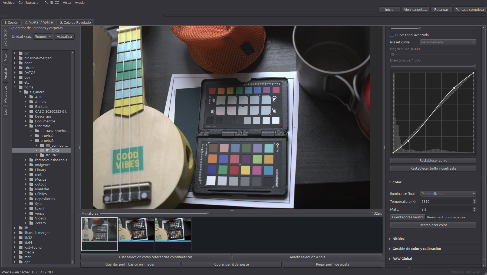

_Versión en español: [README.es.md](README.es.md)_

<p align="center">
  
</p>

# NexoRAW

Reproducible and auditable RAW/TIFF development for scientific, forensic and
heritage photography, with session ICC profiling, per-file parametric settings
and open AGPL traceability.

    



## What NexoRAW Is

NexoRAW is not a general-purpose creative editor. Its goal is narrower: make RAW
development explainable, repeatable and reviewable when color accuracy,
provenance and auditability matter.

The current workflow is intentionally ICC-centered:

- with a valid color chart, NexoRAW builds a calibrated development profile and a
  session-specific input ICC profile;
- without a chart, NexoRAW uses a manual development profile and a real standard
  output ICC (`sRGB`, `Adobe RGB (1998)` or `ProPhoto RGB`);
- monitor ICC management affects only on-screen preview;
- DCP support is not an active implementation target for the 0.2 line.

## Current Status

NexoRAW 0.2.6 is suitable for controlled testing, method review and release
candidate validation. It is not yet a certified scientific or forensic
production system.

The current version adds chart reference management from the interface, session
ICC profile versioning, background profile generation and a 3D gamut diagnostic
for pairwise profile comparison.

The latest packaging validation passed with:

```text
218 passed, 1 warning
```

## Documentation

- [User Manual](docs/MANUAL_USUARIO.md)
- [RAW and ICC Methodology](docs/METODOLOGIA_COLOR_RAW.md)
- [Color Pipeline](docs/COLOR_PIPELINE.md)
- [Architecture](docs/ARCHITECTURE.md)
- [Roadmap](docs/ROADMAP.md)
- [Performance](docs/PERFORMANCE.md)
- [Reproducibility](docs/REPRODUCIBILITY.md)
- [NexoRAW Proof](docs/NEXORAW_PROOF.md)
- [C2PA/CAI](docs/C2PA_CAI.md)
- [LibRaw + ArgyllCMS Integration](docs/INTEGRACION_LIBRAW_ARGYLL.md)
- [Debian Package](docs/DEBIAN_PACKAGE.md)
- [macOS Installation](docs/MACOS_INSTALL.md)
- [Windows Installer](docs/WINDOWS_INSTALLER.md)
- [Legal Compliance](docs/LEGAL_COMPLIANCE.md)
- [Third-party Licenses](docs/THIRD_PARTY_LICENSES.md)
- [Changelog](CHANGELOG.md)

## Quick Start From Source

End users should prefer the published installers. For development:

```bash
git clone https://github.com/alejandro-probatia/NexoRAW.git
cd NexoRAW
python3 -m venv .venv
. .venv/bin/activate
pip install -e .[gui]
nexoraw check-tools --out tools_report.json
nexoraw-ui
```

Optional external tools for full profiling/export workflows:

```bash
# Debian/Ubuntu
sudo apt-get install argyll exiftool

# macOS/Homebrew
brew install argyll-cms exiftool
```

## Debian Package

Build and install locally:

```bash
bash packaging/debian/build_deb.sh
sudo apt install ./dist/nexoraw_<version>_amd64.deb
```

The Debian package installs NexoRAW under `/opt/nexoraw` and exposes only the
canonical launchers:

- `nexoraw`
- `nexoraw-ui`

Legacy `iccraw` launchers and internal compatibility scripts are no longer
installed since 0.2.5. If an old beta package is present, remove it before
testing the current package.

## GUI Workflow

The graphical application is organized around three tabs:

| Tab | Purpose |
| --- | --- |
| `1. Sesión` | Create/open a project session and persist capture notes. |
| `2. Ajustar / Aplicar` | Browse RAW files, preview, adjust, profile, copy settings and prepare exports. |
| `3. Cola de Revelado` | Render batches while preserving the profile assigned to each file. |

Session folders are:

```text
00_configuraciones/   session state, recipes, profiles, ICC, reports, cache
01_ORG/               original RAW/DNG/TIFF files and chart captures
02_DRV/               TIFF derivatives, manifests and final outputs
```

The full list of controls and workflows is documented in the
[User Manual](docs/MANUAL_USUARIO.md).

## CLI Examples

Inspect tools and RAW metadata:

```bash
nexoraw check-tools --strict --out tools_report.json
nexoraw raw-info input.raw
nexoraw metadata input.raw --out metadata.json
```

Develop a RAW with a recipe:

```bash
nexoraw develop input.raw \
  --recipe recipe.yml \
  --out output.tiff \
  --audit-linear output_linear.tiff
```

Create a chart-based profile:

```bash
nexoraw detect-chart chart.tiff \
  --out detection.json \
  --preview overlay.png \
  --chart-type colorchecker24

nexoraw sample-chart chart.tiff \
  --detection detection.json \
  --reference testdata/references/colorchecker24_colorchecker2005_d50.json \
  --out samples.json

nexoraw build-develop-profile samples.json \
  --recipe recipe.yml \
  --out development_profile.json \
  --calibrated-recipe recipe_calibrated.yml

nexoraw build-profile samples.json \
  --recipe recipe_calibrated.yml \
  --out camera_profile.icc \
  --report profile_report.json
```

Batch render:

```bash
nexoraw batch-develop ./01_ORG \
  --recipe recipe_calibrated.yml \
  --profile camera_profile.icc \
  --out ./02_DRV \
  --workers 0 \
  --cache-dir ./00_configuraciones/cache
```

Verify provenance:

```bash
nexoraw verify-proof ./02_DRV/capture.tiff.nexoraw.proof.json \
  --tiff ./02_DRV/capture.tiff \
  --raw ./01_ORG/capture.NEF

nexoraw verify-c2pa ./02_DRV/capture.tiff \
  --raw ./01_ORG/capture.NEF \
  --manifest ./02_DRV/batch_manifest.json
```

## Color and Traceability Principles

- A session ICC profile is contextual, not universal.
- A profile is valid only for comparable camera, lens, illuminant, RAW recipe and
  software version.
- Chart-based workflows keep measurement decisions separate from visual
  adjustment decisions.
- TIFF outputs are not overwritten; NexoRAW creates `_v002`, `_v003`, etc.
- NexoRAW Proof links RAW, TIFF, recipe, ICC, settings and hashes.
- C2PA/CAI is available as an interoperable provenance layer when configured.

## License and Governance

- Project license: `AGPL-3.0-or-later`.
- NexoRAW is maintained as a free, open and auditable community project.
- The AGPL is a free software license and does not prohibit third-party
  commercial use; the non-commercial orientation is a governance goal, not an
  additional license restriction.
- Redistribution must respect the licenses of direct and indirect dependencies,
  including LibRaw/rawpy, rawpy-demosaic, ArgyllCMS, ExifTool, Qt/PySide6 and
  C2PA tooling.

Project initiative: **Probatia Forensics SL**, with the community of the
**Asociación Española de Imagen Científica y Forense**.
