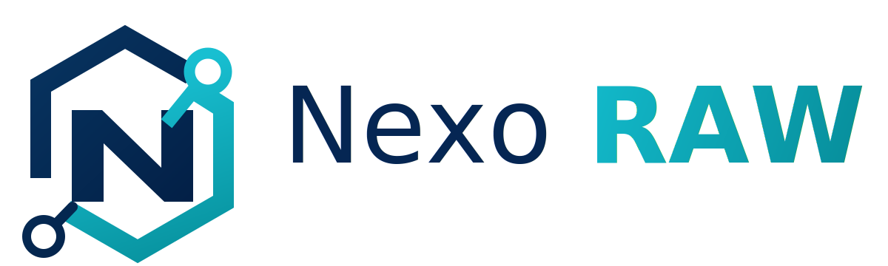
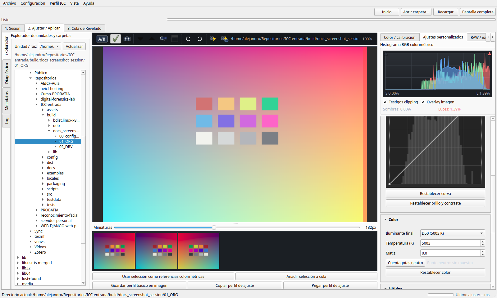

_Versión en español: [README.es.md](README.es.md)_

<p align="center">
  
</p>

# ProbRAW

Reproducible and auditable RAW/TIFF development for scientific, forensic and
heritage photography, with session ICC profiling, per-file parametric settings
and open AGPL traceability.

    



## What ProbRAW Is

ProbRAW is not a general-purpose creative editor. Its goal is narrower: make RAW
development explainable, repeatable and reviewable when color accuracy,
provenance and auditability matter.

The current workflow is intentionally ICC-centered:

- with a valid color chart, ProbRAW builds a calibrated development profile and a
  session-specific input ICC profile;
- without a chart, ProbRAW uses a manual development profile and a real generic
  input ICC (`sRGB`, `Adobe RGB (1998)` or `ProPhoto RGB`);
- monitor ICC management affects only on-screen preview;
- DCP support is not an active implementation target for the 0.3 line.

## Current Status

ProbRAW 0.3.13 is suitable for controlled testing, method review and release
candidate validation. It is not yet a certified scientific or forensic
production system.

The current version fixes a 0.3.12 tone-levels inconsistency: the tone-curve
histogram now represents the input to the curve, and the full-image clipping
histogram is marked as updating while exact real-pixel metrics are recalculated.

The latest packaging validation passed with:

```text
382 passed, 2 warnings
```

## Documentation

- [User Manual](docs/MANUAL_USUARIO.md)
- [RAW and ICC Methodology](docs/METODOLOGIA_COLOR_RAW.md)
- [Color Pipeline](docs/COLOR_PIPELINE.md)
- [Architecture](docs/ARCHITECTURE.md)
- [Roadmap](docs/ROADMAP.md)
- [Performance](docs/PERFORMANCE.md)
- [Reproducibility](docs/REPRODUCIBILITY.md)
- [ProbRAW Proof](docs/PROBRAW_PROOF.md)
- [C2PA/CAI](docs/C2PA_CAI.md)
- [LibRaw + ArgyllCMS Integration](docs/INTEGRACION_LIBRAW_ARGYLL.md)
- [Debian Package](docs/DEBIAN_PACKAGE.md)
- [macOS Installation](docs/MACOS_INSTALL.md)
- [Windows Installer](docs/WINDOWS_INSTALLER.md)
- [Legal Compliance](docs/LEGAL_COMPLIANCE.md)
- [Third-party Licenses](docs/THIRD_PARTY_LICENSES.md)
- [Changelog](CHANGELOG.md)

## Quick Start From Source

End users should prefer the published installers. For development:

```bash
git clone https://github.com/alejandro-probatia/ProbRAW.git
cd ProbRAW
python3 -m venv .venv
. .venv/bin/activate
pip install -e .[gui]
probraw check-tools --out tools_report.json
probraw-ui
```

Optional external tools for full profiling/export workflows:

```bash
# Debian/Ubuntu
sudo apt-get install argyll exiftool

# macOS/Homebrew
brew install argyll-cms exiftool
```

## Debian Package

Build and install locally:

```bash
bash packaging/debian/build_deb.sh
sudo apt install ./dist/probraw_<version>_amd64.deb
```

The Debian package installs ProbRAW under `/opt/probraw` and exposes only the
canonical launchers:

- `probraw`
- `probraw-ui`

Legacy `nexoraw`/`iccraw` launchers and internal compatibility scripts are no
longer installed. The package declares replacement/conflict metadata so current
installers can supersede previous beta names cleanly.

## GUI Workflow

The graphical application is organized around three tabs:

| Tab | Purpose |
| --- | --- |
| `1. Sesión` | Create/open a project session and persist capture notes. |
| `2. Ajustar / Aplicar` | Browse RAW files, preview, adjust, profile, copy settings and prepare exports. |
| `3. Cola de Revelado` | Render batches while preserving the profile assigned to each file. |

Session folders are:

```text
00_configuraciones/   session state, recipes, profiles, ICC, reports, cache
01_ORG/               original RAW/DNG/TIFF files and chart captures
02_DRV/               TIFF derivatives, manifests and final outputs
```

The full list of controls and workflows is documented in the
[User Manual](docs/MANUAL_USUARIO.md).

## CLI Examples

Inspect tools and RAW metadata:

```bash
probraw check-tools --strict --out tools_report.json
probraw raw-info input.raw
probraw metadata input.raw --out metadata.json
```

Develop a RAW with a recipe:

```bash
probraw develop input.raw \
  --recipe recipe.yml \
  --out output.tiff \
  --audit-linear output_linear.tiff
```

Create a chart-based profile:

```bash
probraw detect-chart chart.tiff \
  --out detection.json \
  --preview overlay.png \
  --chart-type colorchecker24

probraw sample-chart chart.tiff \
  --detection detection.json \
  --reference testdata/references/colorchecker24_colorchecker2005_d50.json \
  --out samples.json

probraw build-develop-profile samples.json \
  --recipe recipe.yml \
  --out development_profile.json \
  --calibrated-recipe recipe_calibrated.yml

probraw build-profile samples.json \
  --recipe recipe_calibrated.yml \
  --out camera_profile.icc \
  --report profile_report.json
```

Batch render:

```bash
probraw batch-develop ./01_ORG \
  --recipe recipe_calibrated.yml \
  --profile camera_profile.icc \
  --out ./02_DRV \
  --workers 0 \
  --cache-dir ./00_configuraciones/cache
```

Verify provenance:

```bash
probraw verify-proof ./02_DRV/capture.tiff.probraw.proof.json \
  --tiff ./02_DRV/capture.tiff \
  --raw ./01_ORG/capture.NEF

probraw verify-c2pa ./02_DRV/capture.tiff \
  --raw ./01_ORG/capture.NEF \
  --manifest ./02_DRV/batch_manifest.json
```

## Color and Traceability Principles

- A session ICC profile is contextual, not universal.
- A profile is valid only for comparable camera, lens, illuminant, RAW recipe and
  software version.
- Chart-based workflows keep measurement decisions separate from visual
  adjustment decisions.
- TIFF outputs are not overwritten; ProbRAW creates `_v002`, `_v003`, etc.
- ProbRAW Proof links RAW, TIFF, recipe, ICC, settings and hashes.
- C2PA/CAI is available as an interoperable provenance layer when configured.

## License and Governance

- Project license: `AGPL-3.0-or-later`.
- ProbRAW is maintained as a free, open and auditable community project.
- The AGPL is a free software license and does not prohibit third-party
  commercial use; the non-commercial orientation is a governance goal, not an
  additional license restriction.
- Redistribution must respect the licenses of direct and indirect dependencies,
  including LibRaw/rawpy, rawpy-demosaic, ArgyllCMS, ExifTool, Qt/PySide6 and
  C2PA tooling.

ProbRAW is led by [**Probatia Forensics SL**](https://probatia.com) in
collaboration with the
[**Asociación Española de Imagen Científica y Forense**](https://imagencientifica.es).
