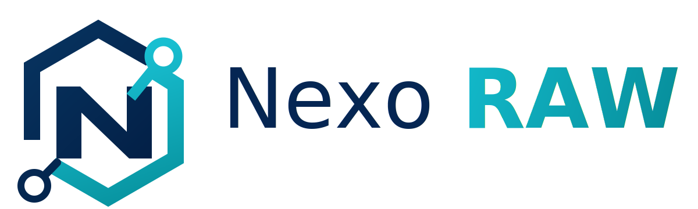

_Spanish version: [README.es.md](README.es.md)_

<p align="center">
  
</p>

# NexoRAW

Reproducible and auditable RAW pipeline for scientific, forensic and heritage photography, with per-session ICC profiling and open AGPL traceability.

    


## Quickstart in 60 seconds
```bash
git clone https://github.com/alejandro-probatia/NexoRAW.git && cd NexoRAW
python3 -m venv .venv && . .venv/bin/activate && pip install -e .
bash examples/demo_session/run_demo.sh
```
## Quick comparison

| Deciding point | NexoRAW | Creative/Business Alternatives |
| --- | --- | --- |
| Reproducible reveal + JSON sidecars with hashes | ✅ | ⚠️ partial / ❌ |
| Double pass letter -> calibrated recipe -> ICC | ✅ | ❌ |
| Colorimetric validation with holdout + operational status of the profile | ✅ | ⚠️ partial / ❌ |
| Main focus | Scientific/forensic traceability per session | Creative development, commercial flow or isolated colorimetry |

Full comparison: [docs/COMPARISON.md](docs/COMPARISON.md)

## Complete documentation

- [User Manual](docs/MANUAL_USUARIO.md)
- [Architecture](docs/ARCHITECTURE.md)
- [Color Pipeline](docs/COLOR_PIPELINE.md)
- [Performance and benchmarks](docs/PERFORMANCE.md)
- [Reproducibility and goldens](docs/REPRODUCIBILITY.md)
- [Roadmap](docs/ROADMAP.md)

## Project objective

The main objective is to build a community tool that allows
work with RAW images under criteria of reproducibility, control
colorimetric and traceability. NexoRAW does not seek to be a generalist editor or a
creative alternative to Lightroom, Darktable or RawTherapee. Its focus is more
narrow:

- reveal RAW with explicit and audit-friendly parameters,
- generate advanced adjustment profiles from chart captures under a
  concrete illuminant,
- generate a scientific development recipe before building the ICC,
- produce specific ICC profiles for camera, optics, illuminant and recipe,
- apply that session package to target images without mixing decisions
  aesthetics with measurement decisions,
- document commands, versions, routes, QA statuses and generated artifacts,
- maintain verifiable use compatible with the licenses of its
  direct and indirect dependencies.

The natural use case is an environment where it is important to be able to justify how
got an image: scientific photography, conservation and heritage,
laboratory, technical documentation, inspection, reproduction of work, analysis
forensic or community projects that need an open processing chain.

## Applied methodology
The NexoRAW methodology starts from a simple idea: a camera ICC profile does not
It must hide basic capture or development problems. Before profiling, the
system attempts to establish a coherent technical basis: white balance,
exposure/density and linear output. The ICC profile is reserved to describe
the remaining colorimetric response of the camera in that session.

The methodological flow is:
1. **Explicit RAW contract**: recipe declares RAW engine, demosaicing, balance
   of whites, levels, tonal curve and workspace. If a parameter is not
   can run with the backend active, the process should fail instead
   replace it silently.
2. **Chart Capture**: One or more color chart images document the
   real lighting, camera, optics and exposure conditions of the session.
3. **Detection and sampling**: The card is detected geometrically and each patch is
   measures with robust strategies, avoiding saturation and reducing the impact of
   noise, edges or contaminated samples.
4. **Scientific Reveal Profile**: The neutral row of the card is used to
   derive balance, density and exposure corrections. This phase generates a
   Calibrated recipe that remains reproducible and readable.
5. **Second calibrated measurement**: the letter is measured again with the recipe already
   calibrated, reusing the geometry when appropriate so as not to depend on
   rendering changes.
6. **Session ICC Profile**: ArgyllCMS generates the ICC profile from samples
   standardized measurements and references. The profile describes the session; it is not
   universal.
7. **Colorimetric validation**: When there are independent samples, the actual ICC
   It is validated with CMM/ArgyllCMS and DeltaE 76/2000, outliers and status are reported
   operational (`draft`, `validated`, `rejected`, `expired`).
8. **Controlled Application**: Target images are developed with the recipe
   calibrated and declared color management mode: assign input profile
   or convert to an output space using CMM.
9. **Traceability**: each execution produces reviewable artifacts: JSON,
   manifests, QA reports, routes, external tool versions and status
   in profile.

Design principles:
- **Reproducibility before appearance**: scientific mode avoids curves
  creative, opaque automation and undocumented manual adjustments.
- **Separation of responsibilities**: the recipe corrects base development; the ICC
  describes color; the CMM converts between profiles; the GUI only orchestrates those
  modules.
- **Early failure**: an incompatible recipe, an unreliable card, or a
  Absent external tool should produce a clear error.
- **Continuous audit**: the results are not considered only final images,
  but also technical evidence that must be able to be reviewed.
- **Contextual validity**: a profile is only valid for comparable conditions
  camera, optics, illuminant, recipe and software version.

## Scope and limits

NexoRAW works by sessions. A session groups card captures, target RAW,
backpacks, recipes, profiles, exports, reports and work artifacts. This avoids
treat the ICC profile as a permanent property of the camera: the profile is
understood as an operational description of a specific configuration.

NexoRAW does not intend to:

- improve photographs with aesthetic criteria,
- replace a colorimetric validation laboratory,
- ensure forensic validity alone,
- generate a universal profile for any light or scene,
- hide critical dependencies such as LibRaw/rawpy, ArgyllCMS or ExifTool.

The goal of release 0.2 is to provide an installable and verifiable foundation for
controlled tests, technical discussion and community expansion.

Community maintenance:

- **Probatia Forensics SL** initiative, maintained as an open project,
  free and collaborative.
- Community of the **Spanish Association of Scientific and Forensic Image**.

## Current status (important)

NexoRAW is in active development phase. Although there is already CLI, GUI and installer
Linux operating for testing, the application **is not yet validated for
scientific/forensic production**.

Use for now as a prototyping, technical evaluation and controlled testing environment.

## Current stack- Language: **Python** (the only toolchain of the project).
- RAW development: **LibRaw** using `rawpy`, with default DCB and support
  AMaZE when the environment uses `rawpy-demosaic`/LibRaw with GPL3.
- Rich RAW metadata: `rawpy` (LibRaw) + `exiftool`.
- Geometric detection: `OpenCV`.
- Colorimetry and DeltaE: `colour-science`.
- Export TIFF 16-bit: `tifffile`.
- ICC profile engine: **ArgyllCMS (`colprof`)**.
- CMM ICC output and profile preview: **ArgyllCMS (`cctiff`/`xicclu`)**.
- GUI (optional): **Qt for Python (`PySide6`)**.

## Installation

For end users, NexoRAW is distributed via installers. The user
you should not install Python or dependencies manually: the installer leaves the GUI,
CLI, icon, external tools and RAW backend ready to use.

For development from code:
```bash
python3 -m venv .venv
. .venv/bin/activate
pip install -e .
# Opcional (interfaz grafica Qt):
# pip install -e .[gui]
```
Optional but recommended for profiling with ArgyllCMS and real ICC conversion:
```bash
# Debian/Ubuntu
sudo apt-get install argyll exiftool
# macOS/Homebrew
brew install argyll-cms exiftool
bash scripts/check_tools.sh
nexoraw check-tools --out tools_report.json
```
## Debian Package

The current release can be built as installable package `.deb`:
```bash
bash packaging/debian/build_deb.sh
sudo apt install ./dist/nexoraw_<version>_amd64.deb
```
The package installs the application in `/opt/nexoraw`, creates the launchers
`nexoraw`/`nexoraw-ui` and declares the external dependencies of the pipeline. See
[Debian Package](docs/DEBIAN_PACKAGE.md).

## CLI

The entry point is `nexoraw` (also callable as `python -m nexoraw`).
The published installers only expose the `nexoraw` launchers and
`nexoraw-ui`:
```bash
nexoraw raw-info input.raw

nexoraw metadata input.raw --out metadata.json

nexoraw develop input.raw --recipe recipe.yml --out output.tiff --audit-linear output_linear.tiff

# Cache numerica opt-in de demosaico para repetir ajustes sobre el mismo RAW
nexoraw develop input.raw --recipe recipe_cache.yml --out output.tiff --cache-dir ./.nexoraw_cache

nexoraw detect-chart chart.tiff --out detection.json --preview overlay.png --chart-type colorchecker24

# Si la deteccion automatica falla, marcar cuatro esquinas de la carta:
nexoraw detect-chart chart.tiff \
  --out detection.json \
  --preview overlay.png \
  --chart-type colorchecker24 \
  --manual-corners 2193,1717 3045,1686 3070,2256 2211,2288

nexoraw sample-chart chart.tiff --detection detection.json --reference target.json --out samples.json

# Referencia Color
Checker 24 operativa incluida:
# testdata/references/colorchecker24_colorchecker2005_d50.json

nexoraw build-develop-profile samples.json \
  --recipe recipe.yml \
  --out development_profile.json \
  --calibrated-recipe recipe_calibrated.yml

nexoraw export-cgats samples.json --out samples.ti3

nexoraw build-profile samples.json --recipe recipe_calibrated.yml --out camera_profile.icc --report report.json

nexoraw batch-develop ./raws \
  --recipe recipe_calibrated.yml \
  --profile camera_profile.icc \
  --out ./tiffs \
  --workers 0 \
  --cache-dir ./00_configuraciones/cache
```
For a session without a color chart, the recipe can use `output_space:
srgb`, `adobe_rgb` o `prophoto_rgb` y `output_linear: false`. In that case
`--profile` is optional: NexoRAW reveals the RAW in that standard RGB space with
LibRaw copies a real ICC from the system or from ArgyllCMS and embeds it in the TIFF.

TIFF outputs are not overwritten. If `output.tiff` or
`./tiffs/captura.tiff` already exist, NexoRAW keeps the previous file and
write the new version as `output_v002.tiff`, `captura_v002.tiff`,
`captura_v003.tiff`, etc. In `batch-develop`, the linear audit TIFF in
`_linear_audit/` uses the same version number as the final TIFF.
```bash
# Firma autonoma NexoRAW Proof y C2PA
pip install -e .
pip install -e .[c2pa]

# Diagnostico de instalacion
nexoraw check-c2pa

# Exportacion: si no hay claves configuradas, NexoRAW crea identidad local.
nexoraw batch-develop ./raws \
  --recipe recipe_calibrated.yml \
  --profile camera_profile.icc \
  --out ./tiffs

# Opcional: credenciales externas si el laboratorio ya las tiene.
# set NEXORAW_C2PA_CERT=G:\ruta\chain.pem
# set NEXORAW_C2PA_KEY=G:\ruta\signing.key
```
NexoRAW Proof is automatically generated as an autonomous signature of the project. C2PA
It also tries to embed automatically if `c2pa-python` is available:
first use configured external credentials and if they don't exist, create one
self-issued local identity in `~/.nexoraw/c2pa`. C2PA readers can
show `signingCredential.untrusted` with that local identity; it's a warning
of CAI trust, not an absence of the RAW-TIFF link. The sidecar
`.nexoraw.proof.json` links TIFF and RAW using SHA-256 and includes recipe,
ICC profile, sharpness adjustments, basic/curve correction, color management,
public key of the signer and export context.
```bash
nexoraw verify-proof ./tiffs/captura.tiff.nexoraw.proof.json --tiff ./tiffs/captura.tiff --raw ./raws/captura.NEF
nexoraw verify-c2pa ./tiffs/captura.tiff --raw ./raws/captura.NEF --manifest ./tiffs/batch_manifest.json

nexoraw validate-profile samples.json --profile camera_profile.icc --out validation.json

# Flujo completo automático de sesión:
# 1) develop de capturas de carta
# 2) detección automática de carta
# 3) muestreo y agregación multi-captura
# 4) perfil de revelado: neutralidad + densidad/exposicion desde carta
# 5) segunda medicion con receta calibrada
# 6) build-profile ICC
# 7) aplicacion posterior a imagenes objetivo con receta calibrada + ICC
nexoraw auto-profile-batch \
  --charts ./charts_raw \
  --targets ./raws \
  --recipe recipe.yml \
  --reference target.json \
  --development-profile-out development_profile.json \
  --calibrated-recipe-out recipe_calibrated.yml \
  --profile-out camera_profile.icc \
  --profile-report profile_report.json \
  --validation-report qa_session_report.json \
  --validation-holdout-count 1 \
  --profile-validity-days 30 \
  --out ./tiffs \
  --workdir ./work_auto
```

```bash
nexoraw compare-qa-reports session_a/qa_session_report.json session_b/qa_session_report.json \
  --out qa_comparison.json

nexoraw check-tools --strict --out tools_report.json
```
## Verification
```bash
bash scripts/run_checks.sh
nexoraw check-tools --strict --out tools_report.json
```
On Windows:
```powershell
.\scripts\run_checks.ps1
.\scripts\check_tools.ps1 -Strict
```
RAW performance measurement and GUI fluidity:
```bash
python scripts/benchmark_raw_pipeline.py ./raws/captura.NEF --out tmp/raw_benchmark/results.json
QT_QPA_PLATFORM=offscreen python scripts/benchmark_gui_interaction.py --raw ./raws/captura.NEF --out tmp/gui_benchmark/results.json
```
## Qt Graphical Interface

The application includes a GUI based on **Qt/PySide6** optimized for technical development flow:
```bash
nexoraw-ui
```
Or directly:
```bash
bash scripts/run_ui.sh
```
Work design:

The main interface is organized in 3 tabs:

- `1. Sesión`:
  - create or open work session,
  - save lighting and shooting metadata,
  - define a root directory and automatically create persistent structure:
    - `00_configuraciones/`, `01_ORG/`, `02_DRV/`,
  - persist status, profiles, cache and queue in
    `00_configuraciones/session.json`.
- `2. Ajustar / Aplicar`:
  - full visual system explorer (units + tree + thumbnails),
  - project root selection with automatic opening of `01_ORG/` for
    browse originals,
  - direct selection from thumbnails: choosing a compatible RAW/TIFF allows
    automatically loads into the viewer,
  - horizontal thumbnail strip with resizing, embedded JPEG and fallback
    RAW fast caching,
  - Automatic RAW/DNG preview: fast navigation and maximum quality in
    compare/precision 1:1,
  - optional monitor ICC management to convert sRGB preview to profile
    screen configured before painting in Qt,
  - viewfinder with zoom, pan drag, rotation and original/result comparison,
  - side panel by vertical sections: `Brillo y contraste`, `Color`,
    `Nitidez`, `Gestión de color y calibración` and `RAW Global`,
  - `Configuracion -> Configuracion global`: NexoRAW Identity Proof, C2PA
    optional, preview mode and ICC management of the monitor,
  - `Generar perfil avanzado con carta`: selection of letter captures,
    global RAW criteria adjustment and joint adjustment profile generation
    advanced + ICC input,
  - `Guardar perfil basico en imagen`: knapsack writing for profiles
    manuals without letter,
  - `Copiar perfil de ajuste` / `Pegar perfil de ajuste`: reuse of
    settings between thumbnails,
  - `Corrección básica`: final illuminant, temperature, hue, brightness, levels,
    contrast and midrange curve,
  - `Nitidez`: luminance noise, chromatic noise, sharpness and image correction
    lateral chromatic aberration,
  - `Aplicar sesión`: Export selected RAW or folders with calibrated recipe and session ICC.
- `3. Cola de Revelado`:
  - queue of images to reveal (add/remove/clear),
  - queue execution with status per file (pending/ok/error),
  - Task monitoring and centralized technical log of the pipeline.The header displays a global progress bar for uploads, generation of
profile and batch development, so long jobs always leave a
visible state.

Top menu:

- `Archivo`, `Configuracion`, `Perfil ICC`, `Vista`, `Ayuda`.
- Quick access to load/save recipe, active profile and development actions.
- `Vista` includes full screen (`F11`) and reset panel layout.

Expected GUI support:

- Linux, macOS and Windows (Qt/PySide6, root/drive selector per platform).

The GUI uses the same CLI modules and writes the same JSON/TIFF/ICC artifacts, maintaining traceability.
Additionally, it preserves window size/state and splitters between sessions.
Session exits are normalized within the root directory: profiles in
`00_configuraciones/`, originals in `01_ORG/` and TIFF/preview/manifests in
`02_DRV/`.

Preview and performance notes:

- The viewer internally maintains the `float32` linear RGB preview and generates
  an sRGB image for screen/PNG. Conversion to the ICC profile of the monitor,
  If activated, it is applied only when painting on the screen and does not modify
  artifacts, hashes or manifests.
- During slider and tone curve drags, the interactive preview is
  processes in the background and uses a bounded source so as not to block the thread
  Qt. The heavy final soft drink also remains glued for large images
  when there is no ICC preview active.
- Base previews are cached with file key, recipe and cooking mode
  preview, with memory limit. The thumbnails are generated at maximum size and
  They are rescaled from cache when you move the size control.
- When the file belongs to a session, the persistent cache is saved under
  `00_configuraciones/cache/` with relative paths so that a folder
  project can be moved or shared with another user.
- The numerical cache of the demo (`use_cache: true`) stores `.npy` arrays of
  linear scene and avoid repeating LibRaw when only later settings change
  to the demosaic. The key includes full RAW SHA-256 and LibRaw parameters.

## Reproducible recipe

See example in [testdata/recipes/scientific_recipe.yml](testdata/recipes/scientific_recipe.yml).

Key fields:
- `demosaic_algorithm`
- `raw_developer` (`libraw`)
- `black_level_mode`
- `white_balance_mode`
- `wb_multipliers`
- `output_linear`
- `tone_curve`
- `profiling_mode`
- `profile_engine` (`argyll`, only supported engine)

With the current LibRaw/rawpy backend, `demosaic_algorithm` accepts values like
`dcb`, `dht`, `ahd`, `vng`, `ppg`, `linear` and, if the LibRaw/rawpy build
includes, `amaze`. `dcb` is the installable default; AMaZE requires
`rawpy.flags["DEMOSAIC_PACK_GPL3"] == True`, usually through
`rawpy-demosaic` or your own build of LibRaw with the GPL3 demosaic pack.
Builds that must include AMaZE must install that backend during the
construction, with `scripts/install_amaze_backend.py`, and fail if
`nexoraw check-amaze` does not confirm `DEMOSAIC_PACK_GPL3=True`.

## Reproducibility and limits

- The ICC profile **is not universal**.
- Valid for comparable conditions of camera + optics + illuminant + recipe.
- Demosaicing/WB/tone mapping changes may invalidate colorimetric validity.

## License

- Project license: `AGPL-3.0-or-later`.
- Project objective: scientific, forensic and community without commercial purpose.
- Important legal note: the AGPL is a free license and **does not** restrict commercial use by third parties; The non-commercial objective is expressed as project governance, not as a restrictive clause.
- Project commitment: NexoRAW must remain free, open,
  auditable and respectful of the legal obligations of its dependencies,
  including libraries, external tools and third-party projects.
- For deployments and redeployment, follow:
  - [Legal Compliance and Licensing](docs/LEGAL_COMPLIANCE.md)
  - [Third Party Licenses](docs/THIRD_PARTY_LICENSES.md)
  - [AMaZE GPL3 Support](docs/AMAZE_GPL3.md)

## Documentation- [Architecture](docs/ARCHITECTURE.md)
- [Roadmap](docs/ROADMAP.md)
- [Color Pipeline](docs/COLOR_PIPELINE.md)
- [Performance and Benchmarks](docs/PERFORMANCE.md)
- [Reproducibility](docs/REPRODUCIBILITY.md)
- [Operational review and professionalization plan] (docs/OPERATIVE_REVIEW_PLAN.md)
- [Changelog](CHANGELOG.md)
- [User Manual](docs/MANUAL_USUARIO.md)
- [NexoRAW Proof](docs/NEXORAW_PROOF.md)
- [C2PA/CAI](docs/C2PA_CAI.md)
- [LibRaw + ArgyllCMS Integration](docs/INTEGRACION_LIBRAW_ARGYLL.md)
- [Debian Package](docs/DEBIAN_PACKAGE.md)
- [Installation on macOS] (docs/MACOS_INSTALL.md)
- [Windows Installer](docs/WINDOWS_INSTALLER.md)
- [Legal Compliance and Licensing](docs/LEGAL_COMPLIANCE.md)
- [Third Party Licenses](docs/THIRD_PARTY_LICENSES.md)
- [Decisions](docs/DECISIONS.md)
- [Prioritized Backlog](docs/ISSUES.md)
