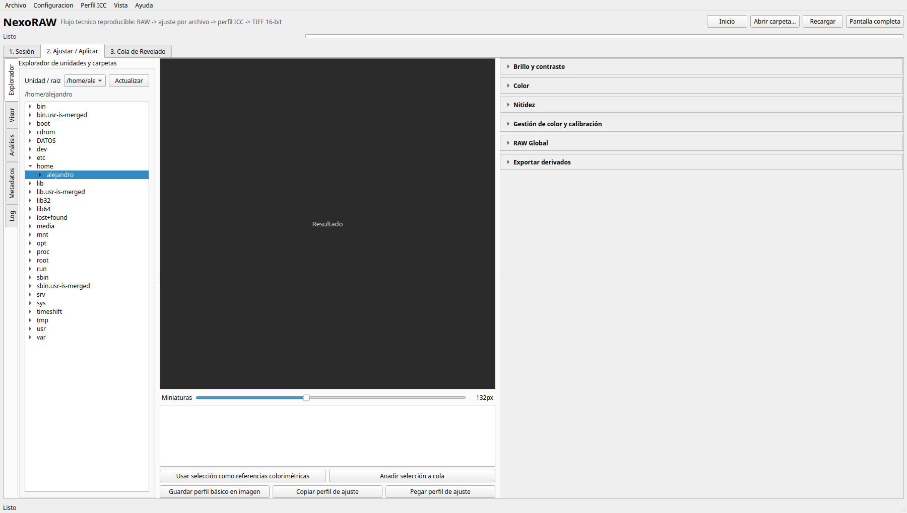
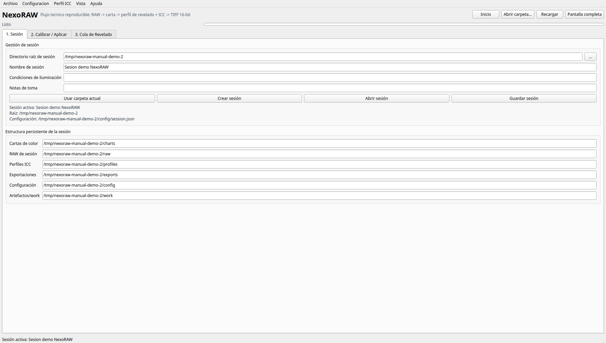
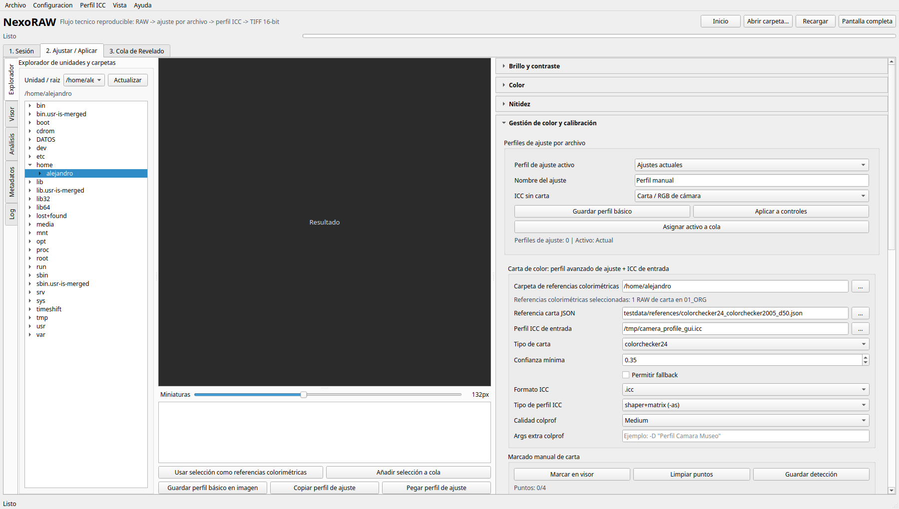
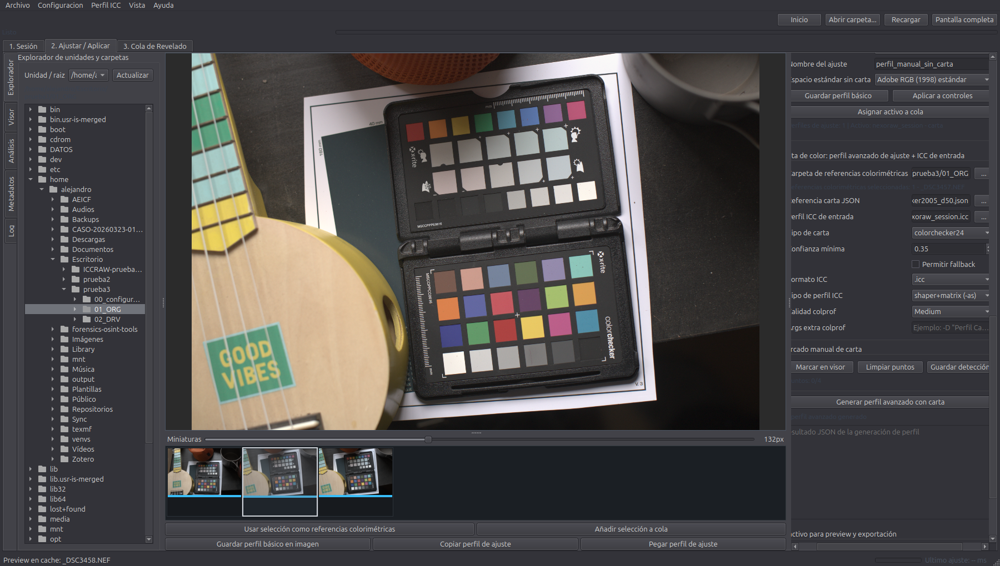
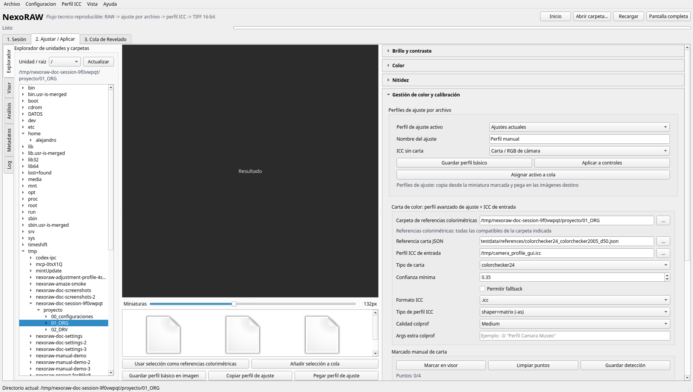
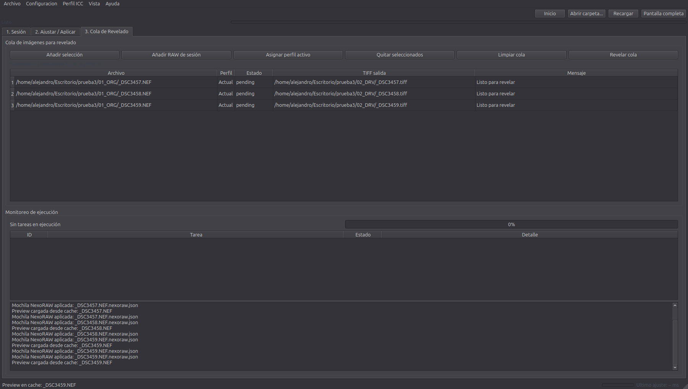
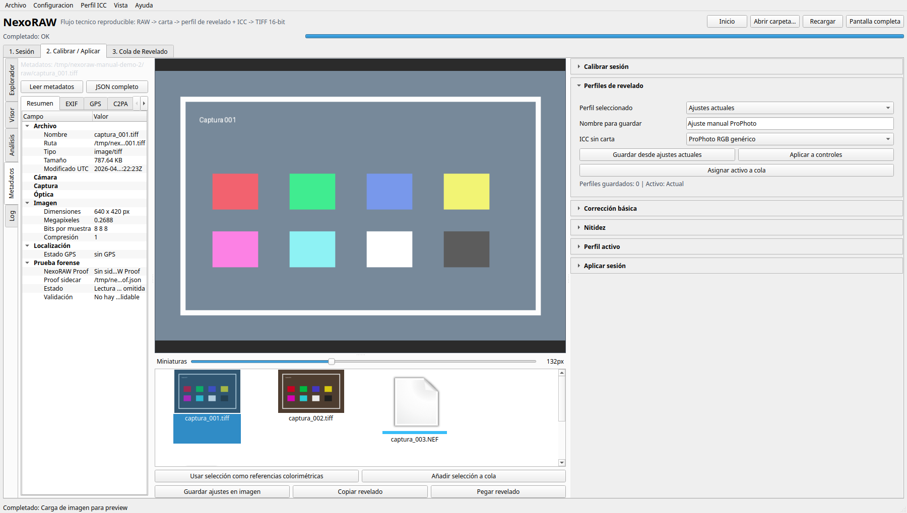
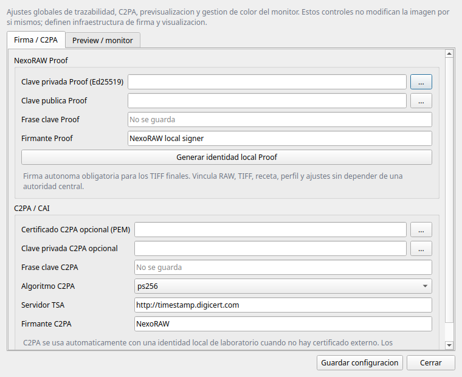

# Manual de Usuario de NexoRAW

NexoRAW es una aplicacion gratuita y abierta para revelado RAW/TIFF con
criterios reproducibles, gestion de color y trazabilidad. Esta pensado para
fotografia tecnico-cientifica, documental, patrimonial y forense: el RAW
original no se modifica nunca y cada TIFF final queda vinculado a sus ajustes,
perfiles, hashes y artefactos de auditoria.

## 1. Instalacion y arranque

NexoRAW se instala mediante los instaladores publicados para cada plataforma.
El usuario no debe instalar Python, dependencias ni herramientas externas a
mano. El instalador deja disponibles:

- la aplicacion grafica `NexoRAW`,
- los comandos `nexoraw` y `nexoraw-ui` para usos avanzados,
- el icono de aplicacion,
- los componentes necesarios para revelar, perfilar, firmar y leer metadatos.

En Linux, macOS y Windows, abre NexoRAW desde el menu de aplicaciones. En Linux
debe aparecer en la categoria de graficos/fotografia.

La documentacion de empaquetado y validacion de instaladores queda fuera de este
manual de usuario y se mantiene en:

- [Publicacion de instaladores](RELEASE_INSTALLERS.md)
- [Paquete Debian](DEBIAN_PACKAGE.md)
- [Instalador Windows](WINDOWS_INSTALLER.md)

## 2. Conceptos basicos

### Sesion

Una sesion es la carpeta de trabajo completa. Contiene RAW originales, ajustes,
lecturas de carta, perfiles, recetas, derivados, cache y artefactos de
auditoria.

Estructura del proyecto:

- `00_configuraciones/`: estado de sesion, recetas, reportes, perfiles de
  ajuste, perfiles ICC, cache e intermedios. Tambien guarda datos o lecturas
  personalizadas de cartas de color cuando existan.
- `01_ORG/`: originales RAW y capturas de carta. Es el directorio de fuentes.
- `02_DRV/`: derivados exportados, TIFF finales, previews y manifiestos.

### Perfil de revelado

Un perfil de ajuste es una receta parametrica asignada a un RAW concreto:
balance, exposicion, temperatura, tono, nitidez, ruido y otros criterios que
pueden copiarse despues a una o varias imagenes.

Puede nacer de dos formas:

- **Perfil avanzado**: nace de una imagen con carta de color. NexoRAW calcula
  ajustes objetivos desde la carta y crea tambien un ICC de entrada propio de la
  sesion. El RAW de carta queda marcado en azul.
- **Perfil basico**: nace de los ajustes hechos por el usuario en los paneles de
  revelado. El RAW queda marcado en verde.

### Mochila NexoRAW

La mochila es el archivo `RAW.nexoraw.json` que queda junto al RAW. Guarda los
ajustes asignados a esa imagen concreta, igual que los sidecars de otros
reveladores RAW.

Las miniaturas indican el tipo de perfil asignado:

- banda azul: RAW con perfil avanzado creado desde carta;
- banda verde: RAW con perfil basico creado desde ajustes manuales.

### Metodologia de trabajo en NexoRAW 0.2

NexoRAW ya no trabaja con la idea de "calibrar una sesion completa" como una
accion global que se aplica a todo sin distinguir archivos. El criterio de la
version 0.2 es mas parecido al de los reveladores RAW consolidados: cada imagen
puede tener un perfil de ajuste asignado, y ese perfil se guarda como edicion
parametrica junto al RAW.

El flujo operativo es:

1. Crear o abrir una sesion de trabajo.
2. Navegar los originales en `01_ORG/`.
3. Elegir una imagen representativa.
4. Ajustarla desde los paneles de la derecha.
5. Guardar ese ajuste como perfil asignado a la imagen.
6. Copiar ese perfil desde la miniatura.
7. Pegar el perfil en otras imagenes tomadas bajo condiciones equivalentes.
8. Enviar esas imagenes a la cola y exportarlas como TIFF en `02_DRV/`.

Cuando existe una carta de color, NexoRAW puede automatizar parte de ese ajuste:
calcula un perfil avanzado desde la carta, genera un ICC de entrada propio de la
sesion y marca la imagen de carta en azul. Cuando no existe carta, el usuario
ajusta manualmente la imagen, guarda un perfil basico y la miniatura queda
marcada en verde.

La carta es la opcion recomendada porque aporta una referencia objetiva
densitometrica y colorimetrica. No es obligatoria: la aplicacion tambien permite
trabajar sin carta con un perfil basico y un ICC generico (`sRGB`, `Adobe RGB
(1998)` o `ProPhoto RGB`), dejando claro en la trazabilidad que no se ha medido
un perfil de entrada propio.

Regla de color:

- con carta: el TIFF maestro usa RGB de camara/sesion e incrusta el ICC de
  entrada generado para esa sesion;
- sin carta: el TIFF usa el ICC generico elegido como perfil de salida
  declarado;
- el perfil del monitor solo afecta a la visualizacion en pantalla y nunca
  modifica los TIFF ni los manifiestos.

## 3. Crear o abrir una sesion

1. Abre NexoRAW.
2. En `1. Sesion`, elige el directorio raiz de la sesion.
3. Escribe un nombre de sesion.
4. Anade, si procede, condiciones de iluminacion y notas de toma.
5. Pulsa `Crear sesion` o `Abrir sesion`.
6. Coloca los RAW de trabajo y las capturas de carta en `01_ORG/`.

Esta primera pestaña solo define el lugar de trabajo. Los perfiles de ajuste
se gestionan despues, en `2. Ajustar / Aplicar`, cuando ya se estan revisando
imagenes y ajustes.

Si abres una raiz de proyecto desde `Abrir carpeta...`, NexoRAW muestra
directamente `01_ORG/` para navegar las imagenes. Si estas dentro de `01_ORG/`
y pulsas `Usar carpeta actual`, la aplicacion reconoce la raiz del proyecto
completo.

Al cambiar de proyecto, NexoRAW limpia la seleccion anterior, la cola visual y
las rutas persistidas que no pertenecen a la nueva raiz. Las sesiones antiguas
que todavia tengan carpetas `raw/`, `charts/`, `exports/`, `profiles/`,
`config/` o `work/` se abren sin conversion destructiva; cuando es posible, una
ruta heredada como `raw/captura.NEF` se resuelve automaticamente contra
`01_ORG/captura.NEF`.

## 4. Flujo recomendado: con carta de color

Este es el flujo preferente cuando se busca la mayor objetividad colorimetrica.
La carta permite crear dos artefactos relacionados:

- un perfil avanzado de ajuste, asignado a los RAW de carta;
- un perfil ICC de entrada propio del proyecto.

Pasos:

1. Entra en `2. Ajustar / Aplicar`.
2. Navega hasta la carpeta donde estan las capturas de carta.
3. Selecciona una o varias capturas de carta.
4. Pulsa `Usar seleccion como referencias colorimetricas`.
5. Revisa en `Gestión de color y calibración` la referencia JSON, el tipo de
   carta y el formato ICC. Ajusta los criterios de demosaico y RAW base en
   `RAW Global` si es necesario.
6. Si la deteccion automatica falla, usa `Marcar en visor`, indica las cuatro
   esquinas y guarda la deteccion.
7. Pulsa `Generar perfil avanzado con carta`.
8. Revisa el reporte, los overlays y el estado del perfil.

Resultado:

- receta calibrada en `00_configuraciones/`,
- perfil avanzado de ajuste en `00_configuraciones/development_profiles/`,
- ICC de entrada del proyecto en `00_configuraciones/profiles/`,
- reportes de perfil/QA y cache en `00_configuraciones/`.
- mochila `RAW.nexoraw.json` en los RAW de carta usados para generar el perfil.

Cuando hay carta, el TIFF maestro conserva RGB de camara e incrusta el
ICC de entrada generado. No se convierte directamente a sRGB, Adobe RGB o
ProPhoto en ese maestro, para evitar dobles conversiones y conservar un
artefacto mas auditable.

## 5. Flujo alternativo: sin carta de color

Este flujo es valido cuando no existe una referencia colorimetrica. Es menos
objetivo que el flujo con carta, pero permite trabajar de forma parametrica y
trazable.

Pasos:

1. Selecciona una imagen representativa de la serie.
2. Ajusta `Brillo y contraste`, `Color`, `Nitidez` y los parametros de
   `RAW Global` necesarios.
3. Abre `Gestión de color y calibración`.
4. Escribe un nombre para el perfil.
5. En `Espacio estandar sin carta`, elige el espacio real de salida:
   - `sRGB estandar`,
   - `Adobe RGB (1998) estandar`,
   - `ProPhoto RGB estandar`.
6. Pulsa `Guardar perfil básico`.
7. Pulsa `Guardar perfil basico en imagen` para escribir la mochila junto al RAW.

Resultado:

- perfil manual en `00_configuraciones/development_profiles/`,
- ICC estandar copiado desde el sistema o ArgyllCMS en `00_configuraciones/profiles/standard/`,
- mochila `RAW.nexoraw.json` con `generic_output_icc`,
- TIFF final en `02_DRV/` revelado en ese espacio e ICC estandar incrustado.

Usa este flujo cuando no hay carta. Si mas adelante se incorpora una carta
valida para esa misma condicion de captura, conviene generar un perfil avanzado
con carta y usarlo como referencia principal.

## 6. Copiar y pegar perfiles de ajuste entre imagenes

NexoRAW trata el revelado RAW como edicion parametrica. La forma practica de
reutilizar ajustes es copiar el perfil asignado a una miniatura y pegarlo en
otras. Puede ser un perfil avanzado de carta o un perfil basico manual.

Pasos:

1. Selecciona la imagen que contiene el perfil correcto.
2. Pulsa `Guardar perfil basico en imagen` si es un ajuste manual que aun no
   tiene mochila.
3. Pulsa `Copiar perfil de ajuste`.
4. Selecciona una o varias imagenes de destino.
5. Pulsa `Pegar perfil de ajuste`.
6. Revisa que las miniaturas de destino conservan el color del tipo de perfil:
   azul para avanzado, verde para basico.

Tambien puedes usar el menu contextual de la miniatura para guardar, copiar o
pegar perfiles de ajuste.

## 7. Exportar TIFF finales y cola de revelado

La cola permite procesar una seleccion o un lote completo sin perder que perfil
de revelado corresponde a cada archivo.

Pasos:

1. Selecciona una o varias imagenes.
2. Pulsa `Anadir seleccion a cola`.
3. Si procede, activa un perfil de revelado y pulsa `Asignar perfil activo`.
4. Revisa en la tabla la columna `Perfil`.
5. Pulsa `Revelar cola`.
6. Revisa el monitor de ejecucion y el log.

Cada TIFF final puede generar:

- TIFF 16-bit final;
- TIFF lineal de auditoria en `_linear_audit/`;
- sidecar `*.nexoraw.proof.json`;
- mochila `RAW.nexoraw.json`;
- `batch_manifest.json`;
- metadatos C2PA si estan configurados.

Si el TIFF de salida ya existe, NexoRAW crea una version nueva:
`captura.tiff`, `captura_v002.tiff`, `captura_v003.tiff`, etc.

## 8. Ajustes de imagen

### Brillo y contraste

Incluye brillo, niveles, contraste, curva de medios y curva tonal avanzada.

### Color

Incluye iluminante final, temperatura, matiz y cuentagotas neutro. El
cuentagotas ayuda a estimar una correccion de temperatura/matiz desde una zona
neutral.

### Nitidez

Incluye nitidez, radio, reduccion de ruido de luminancia/color y correccion de
aberracion cromatica lateral. Estos ajustes se aplican al preview y al render
final cuando `Aplicar ajustes basicos y de nitidez` esta activo.

### Gestión de color y calibración

Agrupa los perfiles de ajuste por archivo, la generacion de perfil avanzado con
carta y el ICC activo. En el flujo con carta, el ICC activo es el ICC de entrada
generado para esos RAW y debe corresponder a la misma receta, camara, optica e
iluminacion.

### RAW Global

Agrupa los parametros base del revelado RAW: motor, demosaico, balance de
blancos RAW, niveles negros, exposicion base, curva RAW y espacios de trabajo.

## 9. Metadatos, Proof y trazabilidad

La pestaña vertical `Metadatos` permite revisar el archivo seleccionado.

Muestra:

- resumen tecnico,
- EXIF y datos de fabricante,
- GPS si existe,
- informacion C2PA,
- NexoRAW Proof,
- JSON completo disponible.

NexoRAW Proof es la firma autonoma obligatoria del proyecto. Vincula RAW, TIFF,
receta, perfil, ajustes, hashes y clave publica del firmante. C2PA/CAI es una
capa interoperable opcional.

## 10. Gestion de color del monitor

Las opciones globales estan en `Configuracion > Configuracion global...`.

En `Preview / monitor`, NexoRAW usa por defecto el perfil ICC configurado en el
sistema operativo:

- ColorSync en macOS,
- `colord` o `_ICC_PROFILE` en Linux/BSD,
- WCS/ICM en Windows.

Si el sistema no expone ningun perfil, NexoRAW usa sRGB como fallback. Esta
gestion solo afecta a la visualizacion en pantalla y miniaturas; no modifica
TIFFs, hashes, perfiles de sesion ni manifiestos.

## 11. Rendimiento y cache

NexoRAW separa navegacion, preview de trabajo y render final:

- la navegacion usa una tira horizontal de miniaturas con tamaño ajustable;
- los RAW usan primero su miniatura embebida y, si no existe, un revelado
  rapido cacheado para no mostrar solo un icono generico;
- la revision critica puede hacerse con preview de alta calidad;
- el render final se ejecuta con el pipeline auditado.

La sesion guarda cache persistente en `00_configuraciones/cache/`. Si se
comparte la carpeta completa de sesion con otro usuario, esa cache puede
acelerar la apertura de la misma estructura de archivos.

Buenas practicas:

- usa preview automatica para navegar; NexoRAW baja resolucion solo durante la
  interaccion cuando es necesario para mantener fluidez;
- activa comparar/precision 1:1 cuando revises nitidez o color a pixel real;
- activa `use_cache: true` en recetas de trabajo si vas a repetir ajustes sobre
  los mismos RAWs y quieres reutilizar el demosaico numerico;
- no regeneres perfiles si solo cambias ajustes finales;
- guarda mochilas antes de copiar ajustes a otras imagenes;
- trabaja dentro de la estructura de sesion para que rutas relativas, cache y
  sidecars sigan siendo transportables.

## 12. Problemas frecuentes

### No veo AMaZE disponible

AMaZE solo aparece si el instalador incluye el backend GPL3 correspondiente. Si
no esta disponible, NexoRAW usa un algoritmo soportado como DCB y lo registra en
la receta.

### La deteccion de carta falla

Usa una captura con la carta completa, sin reflejos y con parches no saturados.
Si falla la deteccion automatica, usa `Marcar en visor` y guarda las cuatro
esquinas manualmente.

### El perfil produce dominante o clipping

Comprueba que la carta, la referencia JSON y la receta corresponden a la misma
condicion de captura. Revisa que no se haya usado un TIFF derivado como carta y
que el perfil no este rechazado por QA.

### No hay carta de color

Usa el flujo sin carta: perfil manual + espacio RGB estandar real de salida. Es
funcional y trazable, pero no sustituye la precision de una referencia
colorimetrica real.

### La imagen ya tenia un TIFF exportado

NexoRAW no sobrescribe salidas existentes. Crea una nueva version con sufijo
`_v002`, `_v003`, etc.

## 13. Documentacion relacionada

- [Metodologia de revelado RAW y gestion ICC](METODOLOGIA_COLOR_RAW.md)
- [NexoRAW Proof](NEXORAW_PROOF.md)
- [C2PA/CAI](C2PA_CAI.md)
- [Integracion LibRaw + ArgyllCMS](INTEGRACION_LIBRAW_ARGYLL.md)
- [Publicacion de instaladores](RELEASE_INSTALLERS.md)
- [Licencias de terceros](THIRD_PARTY_LICENSES.md)
- [Changelog](../CHANGELOG.md)
