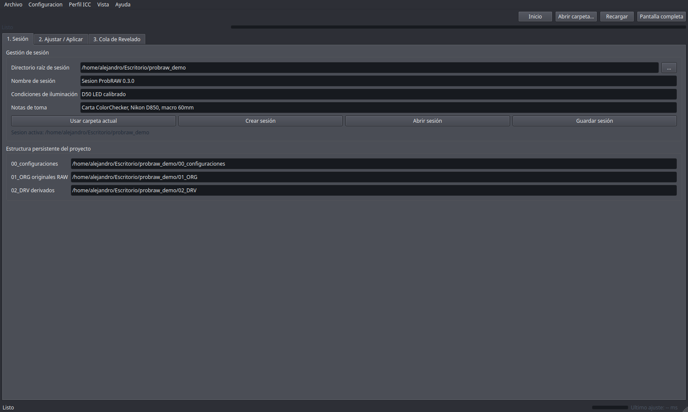
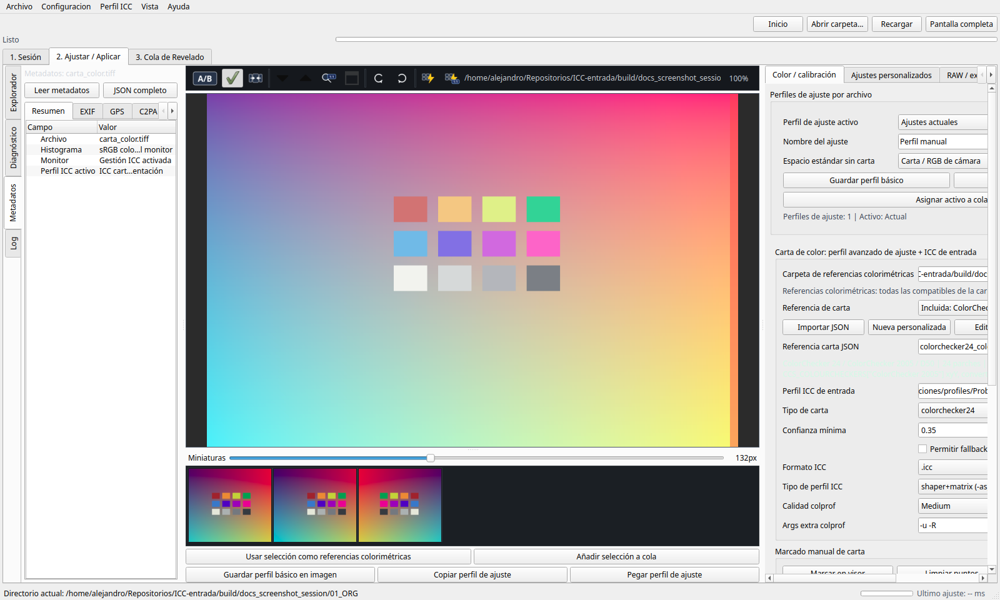
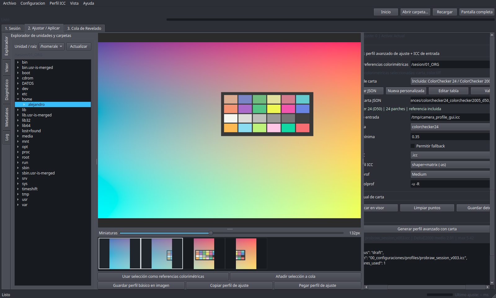
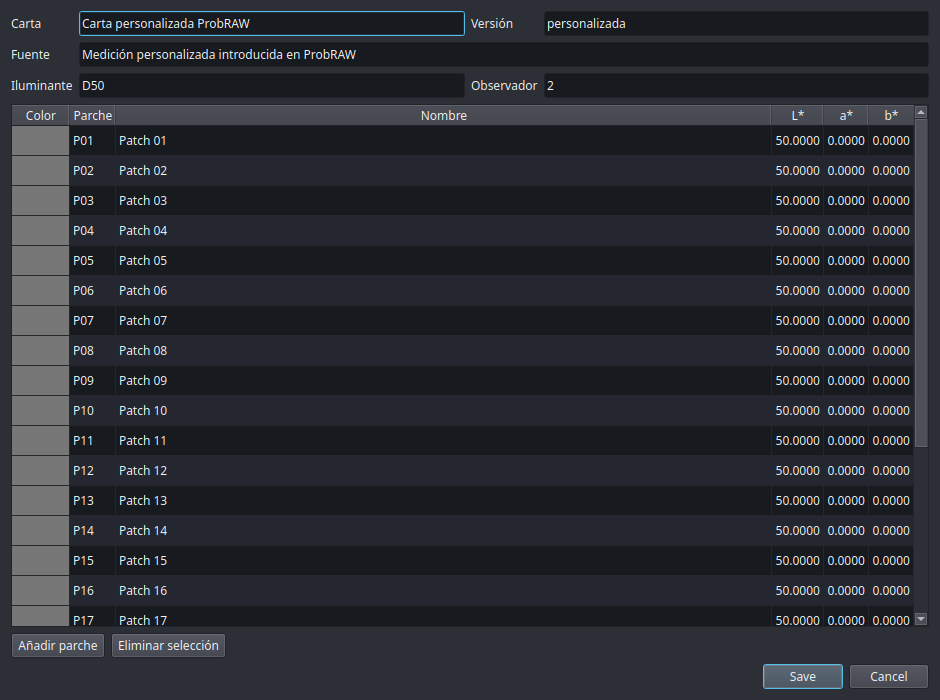
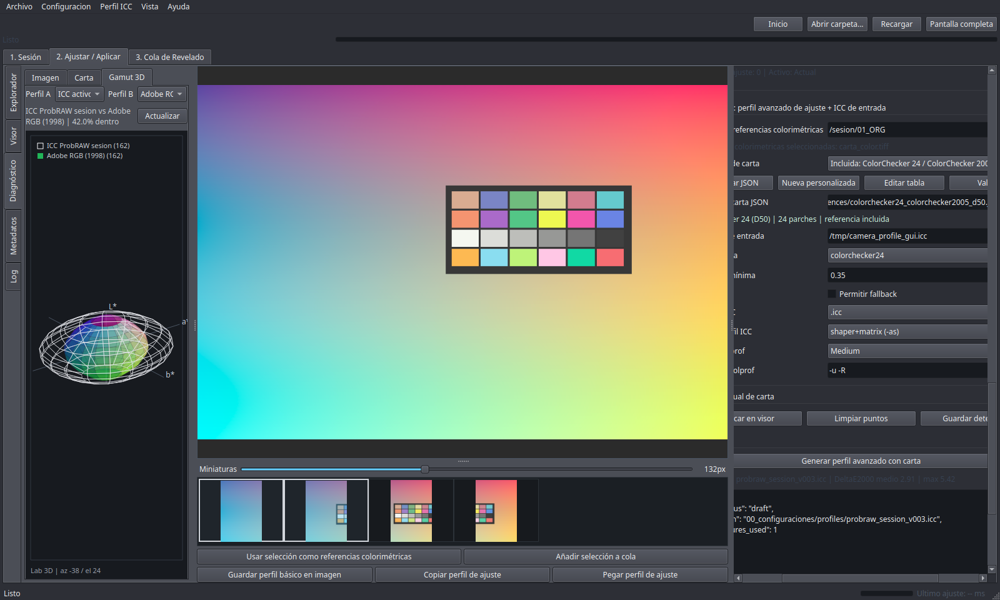
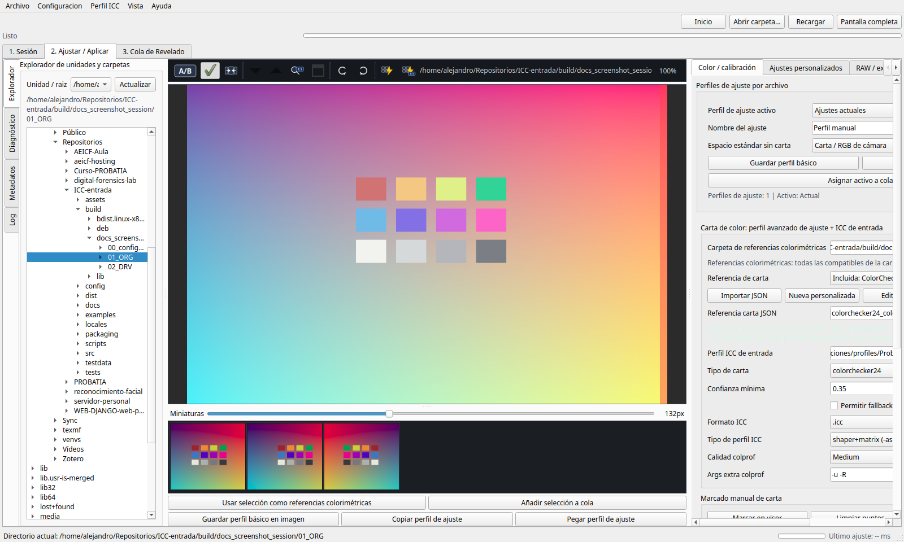
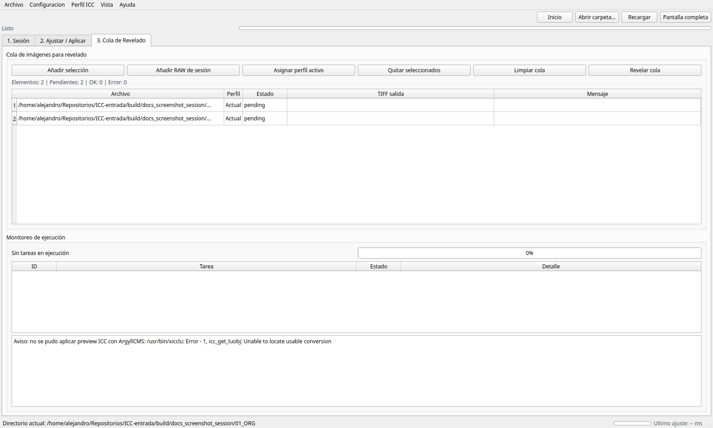
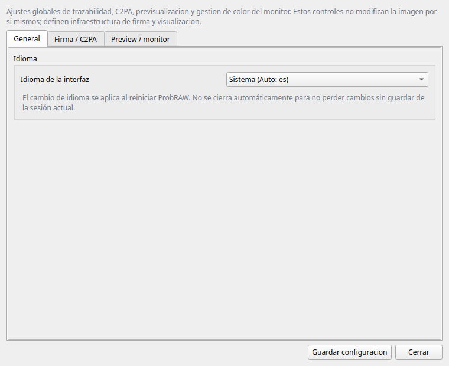

_Versión en español: [MANUAL_USUARIO.es.md](MANUAL_USUARIO.es.md)_

# ProbRAW User Manual

ProbRAW is a free and open application for RAW/TIFF development with
reproducible criteria, ICC color management and traceability. It is designed for
technical, scientific, documentary, heritage and forensic photography: the
original RAW file is never modified, and each final TIFF remains linked to its
settings, profiles, hashes and audit artifacts.

This manual covers the complete ProbRAW 0.3.2 workflow: session creation, color
chart profiling, manual work without a chart, settings copy/paste, render queue,
TIFF export, metadata, Proof, C2PA, 3D gamut diagnostics, chart reference
management, global settings and the meaning of every visible option in the
interface.

## 1. Installation and Startup

Install ProbRAW using the published package for your platform. Users should not
install Python, dependencies or external tools manually. The installer provides:

- the graphical `ProbRAW` application;
- the `probraw` and `probraw-ui` commands for advanced use;
- the application icon;
- the components required to develop RAW files, build profiles, sign outputs and
  read metadata.

On Linux, macOS and Windows, open ProbRAW from the application menu. On Linux it
should appear in the graphics/photography category.

Packaging and installer documentation:

- [Installer release process](RELEASE_INSTALLERS.md)
- [Debian package](DEBIAN_PACKAGE.md)
- [Windows installer](WINDOWS_INSTALLER.md)

## 2. Working Concepts

### Session

A session is the complete project folder. It contains originals, settings, chart
measurements, profiles, recipes, derivatives, cache and audit artifacts.

Persistent structure:

| Folder | Purpose |
| --- | --- |
| `00_configuraciones/` | `session.json`, recipes, custom references, development profiles, ICC profiles, reports, cache, intermediates and work artifacts. |
| `01_ORG/` | Original RAW, DNG, original TIFF and chart captures. This is the source directory. |
| `02_DRV/` | Derived TIFFs, previews, manifests and final outputs. |

Older sessions with `raw/`, `charts/`, `exports/`, `profiles/`, `config/` or
`work/` folders are opened in compatibility mode. ProbRAW resolves those paths
against the current structure whenever possible, without destructive conversion.

### Development Profile

A development profile is a parametric recipe assignable to one or more RAW
files: balance, exposure, temperature, tone, sharpening, noise, chromatic
aberration and base RAW criteria. It can be:

- **Advanced with chart**: created from a color chart capture. ProbRAW computes
  objective adjustments from the reference and creates a session input ICC.
- **Basic without chart**: created from manual adjustments in the development
  panels and associated with a standard output ICC.

### ProbRAW Backpack

The backpack is the `RAW.probraw.json` sidecar written next to the RAW file. It
stores the profile assigned to that specific image. Thumbnail markers indicate:

- blue band: advanced profile created from a chart;
- green band: basic profile created from manual adjustments;
- no band: image without an assigned development profile.

### Color Policy

ProbRAW avoids adding a subjective DCP layer on top of the ICC workflow. The
recommended base is scientific and reproducible:

- with a chart: measure a colorimetric reference, build a calibrated recipe and
  generate a session-specific input ICC profile;
- without a chart: use a manual development profile and a real standard ICC
  output space (`sRGB`, `Adobe RGB (1998)` or `ProPhoto RGB`);
- the monitor profile affects only on-screen viewing. It never changes TIFFs,
  session profiles, hashes or manifests.

Practical rule:

| Situation | Recommended output |
| --- | --- |
| Valid chart available | TIFF in camera/session RGB with the generated input ICC embedded. |
| No chart available | TIFF developed into the selected standard space with that standard ICC embedded. |
| On-screen review | Monitor ICC applied only to the preview. |

## 3. Interface Map

### Top Bar

| Control | Function |
| --- | --- |
| `Inicio` | Go to the user's home directory. |
| `Abrir carpeta...` | Open a folder; if it belongs to a session, ProbRAW detects the session root. |
| `Recargar` | Re-list the current directory and refresh thumbnails. |
| `Pantalla completa` | Toggle full screen. Same as `F11`. |
| Status/progress bar | Shows the active task, loading state and global progress. |

### Menus

| Menu | Options |
| --- | --- |
| `Archivo` | Create session, open session, save session (`Ctrl+Shift+S`), open folder (`Ctrl+O`), save preview PNG (`Ctrl+S`), apply adjustments to selection (`Ctrl+R`) and quit (`Ctrl+Q`). |
| `Configuración` | Load recipe, save recipe, restore default recipe, open global settings and jump to Session/Development/Queue tabs. |
| `Perfil ICC` | Load active profile, use generated profile and compare QA reports. |
| `Vista` | Compare original/result, go to Sharpness, full screen and reset panel layout. |
| `Ayuda` | Tool diagnostics, update check and about ProbRAW. |

### Main Tabs

| Tab | Purpose |
| --- | --- |
| `1. Sesión` | Create or open the project structure and save capture notes. |
| `2. Ajustar / Aplicar` | Browse files, preview, adjust, profile, copy settings and prepare exports. |
| `3. Cola de Revelado` | Process batches with the profile assigned to each file. |

## 4. Create or Open a Session

In `1. Sesión`:

| Option | Explanation |
| --- | --- |
| `Directorio raíz de sesión` | Main project folder. ProbRAW creates `00_configuraciones`, `01_ORG` and `02_DRV` inside it. |
| `Nombre de sesión` | Human-readable project name stored in `00_configuraciones/session.json`. |
| `Condiciones de iluminación` | Free note about light, chart, temperature, flash, scene or environment. |
| `Notas de toma` | Free note about camera, lens, exposure, tripod, procedure or incidents. |
| `Usar carpeta actual` | Copies the browser directory as the session root. If you are inside `01_ORG`, it detects the root. |
| `Crear sesión` | Creates folders and a new `session.json`. |
| `Abrir sesión` | Opens an existing session from its root. |
| `Guardar sesión` | Saves metadata, interface state, selection, queue and persisted paths. |

Minimal workflow:

1. Choose a root folder for the project.
2. Enter name, lighting and capture notes if needed.
3. Press `Crear sesión` or `Abrir sesión`.
4. Place RAW files and chart captures in `01_ORG/`.
5. Go to `2. Ajustar / Aplicar`.

## 5. Left Panel: Browsing, Viewer and Metadata

In `2. Ajustar / Aplicar`, the left panel has vertical tabs.

### Explorer

| Option | Explanation |
| --- | --- |
| `Unidad / raíz` | Select the visible drive or mount point for the browser. |
| `Actualizar` | Re-read mounted drives and refresh the tree. |
| Folder tree | Changes the current directory. ProbRAW lists compatible files in the thumbnail strip. |

Browsable files: RAW supported by the engine, DNG, TIFF, PNG, JPEG and JPG. For
colorimetric references, use original RAW/DNG/TIFF captures, not derived outputs.

### Viewer

| Option | Explanation |
| --- | --- |
| `Archivo actual` | Path of the selected file. |
| `Comparar original / resultado` | Shows before/after view. When enabled, ProbRAW loads maximum-quality preview when needed. |
| `Aplicar perfil ICC en resultado` | Applies the active ICC only to the result preview. It is off by default to avoid color casts when the ICC does not match the current camera, recipe and lighting. |
| `-` / `+` | Zoom out or in. |
| `1:1` | Display at real pixel size. |
| `Girar izq.` / `Girar der.` | Rotate the view. This does not modify the RAW file. |
| `Encajar` | Fit image to viewer. |
| `Histograma RGB` | Shows RGB distribution for the active preview. |
| `Testigos de clipping en sombras/luces` | Marks clipping in the histogram. |
| `Overlay clipping en imagen` | Overlays blue for clipped shadows and red for clipped highlights. |
| `Precache carpeta` | Computes normal previews for visible RAW files. |
| `Precache 1:1` | Computes maximum-resolution previews for critical review. |

### Analysis

Shows a technical linear analysis of the preview: ranges, clipping and useful
measurements for checking whether adjustments are stable.

### Metadata

| Option | Explanation |
| --- | --- |
| `Leer metadatos` | Re-read metadata for the selected file. |
| `JSON completo` | Switch to the full metadata dump tab. |
| `Resumen` | Main technical fields. |
| `EXIF` | EXIF and manufacturer data when available. |
| `GPS` | Coordinates when present. |
| `C2PA` | C2PA/CAI manifest information when present. |
| `Todo` | Complete metadata JSON. |

### Log

Shows preview events, warnings, execution traces and workflow messages.

## 6. Central Viewer and Thumbnails

| Option | Explanation |
| --- | --- |
| `Resultado` viewer | RAW preview with current adjustments. |
| `Antes` / `Después` view | Appears when original/result comparison is enabled. |
| `Miniaturas` strip | Lists compatible files in the current directory. Supports multi-selection. |
| Thumbnail slider | Changes thumbnail size within the application limits. |
| `Usar selección como referencias colorimétricas` | Uses selected RAW/DNG/TIFF files as chart references for advanced profiling. |
| `Añadir selección a cola` | Sends selected files to the render queue. |
| `Guardar perfil básico en imagen` | Writes the manual-adjustment backpack next to the selected RAW. |
| `Copiar perfil de ajuste` | Copies the profile assigned to the selected file. |
| `Pegar perfil de ajuste` | Pastes the copied profile into selected images. |

The thumbnail context menu also offers save basic profile, copy, paste, use as
colorimetric reference and add to queue.

## 7. Complete Workflow With a Color Chart

This is the preferred workflow when objective colorimetric precision matters.

1. Create or open the session.
2. Copy chart RAW files and scene RAW files to `01_ORG/`.
3. In `2. Ajustar / Aplicar`, select the chart capture or captures.
4. Press `Usar selección como referencias colorimétricas`.
5. In `Gestión de color y calibración`, review `Referencia de carta`, `Tipo de
   carta`, `Formato ICC`, `Tipo de perfil ICC` and `Calidad colprof`.
6. In `RAW Global`, review demosaic and base RAW criteria. During advanced
   profiling, ProbRAW forces objective measurement settings: linear curve,
   linear output, `scene_linear_camera_rgb`, with denoise and sharpen disabled
   for chart measurement.
7. If automatic detection is not good enough, press `Marcar en visor`. The cursor
   changes to a crosshair. Mark the four visible chart corners in the order shown
   by the overlay, review the points and press `Guardar detección`.
8. Press `Generar perfil avanzado con carta`.
9. Review the result JSON, overlays, QA report and profile status.
10. Press `Usar perfil generado` if you want it to become the active ICC for
    preview/export.
11. Copy the development profile or assign it to the queue for images taken with
    the same camera, lens, lighting and recipe.
12. Render the queue and review TIFF files in `02_DRV/`.

Expected result:

- calibrated recipe in `00_configuraciones/`;
- advanced profile in `00_configuraciones/development_profiles/`;
- input ICC in `00_configuraciones/profiles/`;
- custom references in `00_configuraciones/references/`, if created or imported;
- profile reports, QA, overlays and cache in
  `00_configuraciones/profile_runs/` and `00_configuraciones/work/`;
- `RAW.probraw.json` backpack for the chart RAW files used.

### Chart References and Custom Charts

The bundled default reference is ColorChecker 24 / ColorChecker 2005 / D50. You
can also import an existing JSON reference or create a custom session reference.
Custom references are stored in `00_configuraciones/references/`, appear in the
`Referencia de carta` selector and are restored when the session is reopened.

For a custom chart, use `Nueva personalizada` or `Editar tabla`. The editor shows
one row per patch with its identifier, name and Lab D50 values; the first column
shows an approximate swatch for the entered color so obvious typing mistakes are
easy to spot. Saving generates the JSON reference used by the profiler.

Best practices:

- `patch_id` values must match the chart detection order;
- use Lab D50 values with 2-degree observer for the current ICC workflow;
- document the measurement source in `Fuente`;
- press `Validar` before building the profile.

### Session ICC Profiles and 3D Gamut Comparison

Each generated ICC profile is registered in the session with name, path, status
and source. This allows several versions of the same profile, for example matrix,
cLUT, different references or different ArgyllCMS arguments, without losing
history. The `Perfil ICC de sesión` selector activates any registered version for
preview/export.

The `Diagnóstico > Gamut 3D` tab always compares a pair of profiles, not every
profile at once. Choose `Perfil A` and `Perfil B` from session profiles, the
active ICC, the monitor, sRGB, Adobe RGB, ProPhoto RGB or a custom ICC. The solid
surface represents the second profile and the wireframe represents the first one.
The top text reports how much of profile A is inside profile B and warns when a
generated ICC has extreme Lab coordinates.

## 8. Complete Workflow Without a Color Chart

This workflow is valid when no colorimetric reference exists. It is less
objective, but still parametric and traceable.

1. Select a representative image.
2. Adjust `Brillo y contraste`, `Color`, `Nitidez` and, if needed, `RAW Global`.
3. In `Gestión de color y calibración`, enter `Nombre del ajuste`.
4. In `Espacio estándar sin carta`, choose the real output space: `sRGB
   estándar`, `Adobe RGB (1998) estándar` or `ProPhoto RGB estándar`.
5. Press `Guardar perfil básico`.
6. Press `Guardar perfil básico en imagen` to write the backpack next to the RAW.
7. Copy and paste that profile to equivalent images.
8. Add images to the queue and render.

Expected result:

- manual profile in `00_configuraciones/development_profiles/`;
- standard ICC in `00_configuraciones/profiles/standard/`;
- `RAW.probraw.json` backpack with the generic output space;
- final TIFF in `02_DRV/` with the standard ICC embedded.

## 9. Copy Settings and Backpacks

ProbRAW treats development as per-file parametric editing.

1. Select the image with the correct profile.
2. If the adjustment is manual and has no backpack yet, press `Guardar perfil
   básico en imagen`.
3. Press `Copiar perfil de ajuste`.
4. Select one or more target images.
5. Press `Pegar perfil de ajuste`.
6. Check thumbnail color bands and add to queue if needed.

Best practices:

- do not paste profiles across scenes with different lighting;
- do not mix chart profiles from one camera/lens combination with another;
- keep backpacks next to RAW files when moving a session.

## 10. Render Queue and Export

The queue processes a selection or a complete batch without losing which profile
belongs to each file.

### `3. Cola de Revelado` Tab

| Option | Explanation |
| --- | --- |
| `Añadir selección` | Add selected thumbnail files. |
| `Añadir RAW de sesión` | Add all compatible files from the configured input folder. |
| `Asignar perfil activo` | Assign the active development profile to selected rows or to the queue. |
| `Quitar seleccionados` | Remove selected rows from the queue. |
| `Limpiar cola` | Empty the queue. |
| `Revelar cola` | Run TIFF rendering for valid items. |
| Table `Archivo` | RAW/TIFF/image source. |
| Table `Perfil` | Assigned development profile. |
| Table `Estado` | `pending`, `done` or `error`. |
| Table `TIFF salida` | Generated TIFF path. |
| Table `Mensaje` | Process or error message. |
| `Monitoreo de ejecución` | Global state, progress, task table and log. |

If an output TIFF already exists, ProbRAW creates a new version:
`capture.tiff`, `capture_v002.tiff`, `capture_v003.tiff`, etc.

### `Exportar derivados` Panel

| Option | Explanation |
| --- | --- |
| `RAW a revelar (carpeta)` | Source folder used by `Aplicar a carpeta` or `Añadir RAW de sesión`. |
| `Salida TIFF derivados` | Folder where final TIFFs are saved. In a normal session it points to `02_DRV/`. |
| `Incrustar/aplicar ICC en TIFF` | Always enabled. Embeds the input ICC if output is camera RGB, or a standard ICC if output is sRGB/Adobe RGB/ProPhoto. |
| `Aplicar ajustes básicos y de nitidez` | Applies tone, color, sharpening, noise and CA settings from the profile to the TIFF. |
| `Usar carpeta actual` | Uses the browser directory as batch input. |
| `Aplicar a selección` | Renders the current selection. |
| `Aplicar a carpeta` | Renders all compatible files in the input folder. |
| `Salida JSON de exportación` | Technical result of the export process. |

Each TIFF can generate the final 16-bit TIFF, a linear audit TIFF,
`*.probraw.proof.json`, a backpack, `batch_manifest.json` and C2PA metadata when
configured.

## 11. Right Panel: Complete Settings Reference

### Brightness and Contrast

| Option | Range/values | Explanation |
| --- | --- | --- |
| `Brillo` | `-2.00` to `+2.00 EV` | Final tonal compensation for preview/render. |
| `Nivel negro` | `0.000` to `0.300` | Clips or lifts the output black point. |
| `Nivel blanco` | `0.500` to `1.000` | Defines the output white point. |
| `Contraste` | `-1.00` to `+1.00` | Global contrast adjustment. |
| `Curva medios` | `0.50` to `2.00` | Changes midtone response. |
| `Curva tonal avanzada` | on/off | Enables curve editor and range controls. |
| `Preset curva` | Linear, Soft contrast, Film-like, Lift shadows, High contrast, Custom | Loads an editable curve shape. |
| `Negro curva` | `0.000` to `0.950` | Internal black limit of the advanced curve. |
| `Blanco curva` | `0.050` to `1.000` | Internal white limit of the advanced curve. |
| Curve editor | draggable points | Manually edits the tonal curve. |
| `Restablecer curva` | action | Resets the advanced curve. |
| `Restablecer brillo y contraste` | action | Resets tonal controls. |

### Color

| Option | Range/values | Explanation |
| --- | --- | --- |
| `Iluminante final` | A/tungsten, D50, D55, Flash/D55, D60, D65, D75, Custom | Target white point for rendering. |
| `Temperatura (K)` | `2000` to `12000` | Manual temperature for custom illuminant or fine tuning. |
| `Matiz` | `-100.0` to `+100.0` | Green/magenta correction. |
| `Cuentagotas neutro` | on/off | When enabled, click a neutral area in the viewer; the cursor changes to a crosshair. |
| `Punto neutro` | readout | Shows the neutral sample result. |
| `Restablecer color` | action | Resets illuminant, temperature and tint. |

### Sharpness

| Option | Range/values | Explanation |
| --- | --- | --- |
| `Nitidez (amount)` | `0.00` to `3.00` | Sharpening intensity. |
| `Radio nitidez` | `0.1` to `8.0` | Sharpening radius. |
| `Ruido luminancia` | `0.00` to `1.00` | Luminance noise reduction. |
| `Ruido color` | `0.00` to `1.00` | Chroma noise reduction. |
| `CA lateral rojo/cian` | factor near `1.0000` | Corrects red/cyan lateral chromatic aberration. |
| `CA lateral azul/amarillo` | factor near `1.0000` | Corrects blue/yellow lateral chromatic aberration. |
| `Modo precisión 1:1 para nitidez` | on/off | Uses real-resolution source during sharpness/noise/CA drags. Slower. |
| `Denoise modo receta` | off, mild, medium, strong | Compatibility recipe metadata. Does not modify pixels in the GUI. |
| `Sharpen modo receta` | off, mild, medium, strong | Compatibility recipe metadata. Does not modify pixels in the GUI. |
| `Restablecer nitidez` | action | Resets sharpness, noise and CA. |

### Color Management and Calibration

#### Per-file Development Profiles

| Option | Explanation |
| --- | --- |
| `Perfil de ajuste activo` | Saved profile list. Applying one moves its parameters into the controls. |
| `Nombre del ajuste` | Name for the basic profile to save. |
| `Espacio estándar sin carta` | `Carta / RGB de cámara`, `sRGB estándar`, `Adobe RGB (1998) estándar` or `ProPhoto RGB estándar`. |
| `Guardar perfil básico` | Saves a manual profile from current controls. |
| `Aplicar a controles` | Loads the selected profile into the development controls. |
| `Asignar activo a cola` | Assigns the active profile to queue items. |
| Profile status | Reports profile count and active profile. |

#### Color Chart: Advanced Development Profile + Input ICC

| Option | Explanation |
| --- | --- |
| `Carpeta de referencias colorimétricas` | Folder containing chart captures. If an explicit selection exists, those images are used. |
| `Referencias colorimétricas seleccionadas` | Shows how many chart captures will be used. |
| `Referencia de carta` | Selector for bundled references and custom references saved in the session. |
| `Importar JSON` | Copies a validated external reference into `00_configuraciones/references/`. |
| `Nueva personalizada` | Creates an editable session reference from a template. |
| `Editar tabla` | Opens the Lab table editor with per-patch color swatches. |
| `Validar` | Checks structure, illuminant, observer and Lab values. |
| `Referencia carta JSON` | Path of the selected or generated chart JSON. |
| `Perfil ICC de entrada` | Output path for the generated ICC. |
| `Reporte perfil JSON` | Automatic path for the technical profile report. It normally lives in `00_configuraciones/work/`. |
| `Directorio artefactos` | Automatic directory for overlays, measurements, intermediates and profiling cache. |
| `Perfil de ajuste avanzado JSON` | Automatic path for the development profile computed from the chart. |
| `Receta calibrada` | Automatic path for the recipe produced after chart measurement. |
| `Tipo de carta` | `colorchecker24` or `it8`. Must match the JSON reference. |
| `Confianza mínima` | `0.00` to `1.00`. Acceptance threshold for automatic detection. |
| `Permitir fallback` | Allows alternative criteria if automatic detection does not reach the threshold. Use only if you will review QA. |
| `Formato ICC` | `.icc` or `.icm`. |
| `Tipo de perfil ICC` | `shaper+matrix (-as)`, `gamma+matrix (-ag)`, `matrix only (-am)`, `Lab cLUT (-al)` or `XYZ cLUT (-ax)`. |
| `Calidad colprof` | Low, Medium, High, Ultra. Higher quality costs more compute. |
| `Args extra colprof` | Advanced ArgyllCMS arguments, for example `-D "Museum Camera Profile"`. The default uses `-u -R` to avoid an unrealistically unconstrained gamut. |
| `Cámara (opcional)` | Reserved profile metadata field. In the current interface it is filled automatically or kept hidden. |
| `Lente (opcional)` | Reserved profile metadata field. In the current interface it is filled automatically or kept hidden. |
| `Marcar en visor` | Starts manual four-corner marking. The cursor changes to a crosshair. |
| `Limpiar puntos` | Clears manual marking points. |
| `Guardar detección` | Saves JSON and overlay for a manual detection. |
| `Generar perfil avanzado con carta` | Runs measurement, development profile, input ICC and reports. |
| Result JSON | Technical output from profile generation. |

#### Active ICC for Preview and Export

| Option | Explanation |
| --- | --- |
| `Perfil ICC de entrada activo` | ICC used for preview/export when it matches the session profile. |
| `Perfil ICC de sesión` | Catalog of ICC profiles generated or loaded in the session. |
| `Activar seleccionado` | Activates the selected session profile. |
| `Cargar perfil activo` | Manually selects an existing ICC. |
| `Usar perfil generado` | Registers and activates the latest ICC generated by the chart workflow. |

### RAW Global

| Option | Values | Explanation |
| --- | --- | --- |
| `Receta YAML/JSON` | path | Base recipe file. |
| `Cargar receta` | action | Loads an existing recipe into the controls. |
| `Guardar receta` | action | Saves current criteria as a recipe. |
| `Receta por defecto` | action | Restores the base recipe. |
| `Motor RAW` | `LibRaw / rawpy` | RAW development engine. It is the only available engine. |
| `Demosaic/interpolación` | DCB, DHT, AHD, AAHD, VNG, PPG, Linear, AMaZE | RAW interpolation algorithm. AMaZE is available only when the build reports `DEMOSAIC_PACK_GPL3=True`. |
| `Balance de blancos` | Fixed, From camera metadata | Uses manual multipliers or camera metadata. |
| `WB multiplicadores` | `R,G,B,G` or `R,G,B` | Manual white balance multipliers. |
| `Black level mode` | Metadata, Fixed, White level | Source of RAW black level. |
| Black value | `0` to `65535` | Value used when black mode is fixed. |
| `Exposure compensation (EV)` | `-8.00` to `+8.00` | Base RAW compensation before final rendering. |
| `Tone curve` | Linear, sRGB, Gamma | Base RAW curve. |
| Gamma | `0.80` to `4.00` | Value used when `Tone curve` is Gamma. |
| `Salida lineal` | on/off | Keeps the base pipeline output linear. |
| `Working space (metadato)` | scene_linear_camera_rgb, srgb, adobe_rgb, prophoto_rgb, camera_rgb | Declarative recipe/provenance field. It does not apply an extra transform. |
| `Output space` | scene_linear_camera_rgb, srgb, adobe_rgb, prophoto_rgb, camera_rgb | Development output space. |
| `Sampling strategy` | trimmed_mean, median | Chart patch sampling method. |
| `Profiling mode` | on/off | Enables measurement criteria for profiling. |
| `Input color assumption (metadato)` | camera_native | Declarative field; does not apply an additional color transform. |
| `Illuminant metadata` | text | Free illuminant metadata. |

Note: during `Generar perfil avanzado con carta`, ProbRAW forces
`tone_curve=linear`, `Salida lineal=on` and
`Output space=scene_linear_camera_rgb`. Sharpening and noise reduction are
disabled during chart measurement and applied later in final rendering if the
profile says so.

Recipe fields that are saved even when they are not always directly editable:

| Field | Explanation |
| --- | --- |
| `chart_reference` | JSON reference used to measure the chart. Filled from `Referencia de carta`. |
| `sampling_trim_percent` | Percentage trimmed from each end when robust `trimmed_mean` sampling is used. |
| `sampling_reject_saturated` | Excludes saturated pixels during patch sampling. |
| `profile_engine` | Profiling engine. Currently `argyll`. |
| `argyll_colprof_args` | List derived from `Args extra colprof`. |
| `use_cache` | Advanced field for reusing numeric cache when the workflow allows it. The GUI also keeps its own preview and thumbnail caches. |

## 12. Global Settings

Global settings are in `Configuración > Configuración global...`.

### General

| Option | Explanation |
| --- | --- |
| `Idioma de la interfaz` | `Sistema`, `Español` or `English`. The change applies after restarting ProbRAW. |

### Signature / C2PA

| Option | Explanation |
| --- | --- |
| `Clave privada Proof (Ed25519)` | Local private key used to sign ProbRAW Proof. |
| `Clave pública Proof` | Public key used to verify the signature. |
| `Frase clave Proof` | Unlock passphrase. It is not saved. |
| `Firmante Proof` | Local signer name in Proof sidecars. |
| `Generar identidad local Proof` | Creates a local identity for signing final TIFFs. |
| `Certificado C2PA opcional (PEM)` | External C2PA/CAI certificate, when available. |
| `Clave privada C2PA opcional` | Private key associated with the C2PA certificate. |
| `Frase clave C2PA` | Unlock passphrase. It is not saved. |
| `Algoritmo C2PA` | `ps256`, `ps384`, `es256` or `es384`. |
| `Servidor TSA` | Timestamping URL for C2PA. |
| `Firmante C2PA` | Signer name for the C2PA manifest. |

ProbRAW Proof is the mandatory autonomous project signature. C2PA/CAI is an
interoperable layer that automatically uses a local lab identity when no
external certificate is configured.

### Preview / Monitor

| Option | Explanation |
| --- | --- |
| RAW preview policy | Automatic: fast while browsing and maximum quality in compare/1:1/precision mode. Not editable. |
| `Resolución de preview` | Automatic. Uses full source when needed. |
| `Gestión ICC del monitor del sistema` | Uses the operating system monitor ICC profile. |
| `Perfil ICC monitor` | Manual monitor profile path if you need to override detection. |
| `Detectar` | Finds the system monitor profile. |
| PNG policy | `Guardar preview PNG` always asks for a destination with `Save as...`. |
| `Limpiar caché` | Removes user/session preview and thumbnail caches. They are rebuilt on demand. |

Monitor detection:

- macOS: ColorSync;
- Linux/BSD: `colord` or `_ICC_PROFILE`;
- Windows: WCS/ICM.

If no profile is found, ProbRAW uses sRGB as the visual fallback.

## 13. Metadata, Proof and Traceability

ProbRAW Proof links RAW, TIFF, recipe, profile, settings, hashes and public key.
The `*.probraw.proof.json` sidecar lets you audit that a TIFF corresponds to a
specific RAW and recipe. C2PA/CAI adds a layer compatible with external tools and
trust lists when a recognized certificate is available.

A complete export can contain:

- final 16-bit TIFF;
- linear audit TIFF in `_linear_audit/`;
- `RAW.probraw.json`;
- `*.probraw.proof.json`;
- `batch_manifest.json`;
- C2PA manifest if configured.

## 14. Performance and Cache

ProbRAW separates browsing, preview and final rendering:

- thumbnails use a fast cache;
- RAW files use the embedded preview first when available;
- critical review can load a 1:1 source;
- final rendering uses the audited pipeline.

Best practices:

- use `Precache carpeta` before reviewing many RAW files;
- use `Precache 1:1` before reviewing sharpness or critical detail;
- enable compare/1:1 only when needed;
- do not regenerate profiles if you only changed final adjustments;
- keep the complete session structure together so cache, sidecars and relative
  paths remain portable.

## 15. Troubleshooting

### AMaZE Is Not Available

AMaZE appears as available only if the installation includes the GPL3 LibRaw/rawpy
backend. If it is not available, use DCB or another supported algorithm. ProbRAW
records the chosen algorithm in recipes and reports.

### Chart Detection Fails

Use a capture with the full chart visible, no reflections, no saturated patches
and enough focus. If automatic detection fails, use `Marcar en visor`, mark the
four corners and save the detection.

### Manual Marking Seems to Move

Points are stored in active-preview coordinates and transformed to the full file
when the detection is saved. If you change file, use extreme zoom or reload the
preview, review the overlay before saving.

### The Profile Produces a Color Cast or Clipping

Check that chart, JSON reference, camera, lens, illuminant and recipe match.
Review the QA report and do not use derived TIFFs as input charts.

### There Is No Color Chart

Use the no-chart workflow: manual profile plus a real standard output ICC. It is
traceable, but it does not replace the precision of a measured reference.

### The Image Already Had an Exported TIFF

ProbRAW does not overwrite existing outputs. It creates `_v002`, `_v003`, etc.

## 16. Glossary

| Term | Definition |
| --- | --- |
| AMaZE | High-quality demosaic algorithm available only with GPL3 support in LibRaw/rawpy. |
| ArgyllCMS | Toolset used to create ICC profiles, especially `colprof`. |
| Backpack | `RAW.probraw.json` sidecar with settings assigned to a RAW file. |
| C2PA/CAI | Interoperable provenance and authenticity standard for digital content. |
| Cache | Temporary preview, thumbnail or demosaic data that speeds up later work. |
| Chart | Physical reference with known color patches used to measure deviations. |
| Clipping | Shadow or highlight cut-off where signal becomes black or white without detail. |
| DCP | Camera profile format used by some RAW developers. ProbRAW prioritizes a reproducible ICC workflow. |
| DeltaE 2000 | Perceptual color-difference metric between measured and reference colors. |
| Demosaic | Interpolation that converts the RAW Bayer/X-Trans mosaic into RGB. |
| ICC | Color profile that describes how to interpret or convert color values. |
| Input ICC | Profile describing the camera/session RGB generated from a chart. |
| Standard ICC | Known profile such as sRGB, Adobe RGB or ProPhoto RGB. |
| Illuminant | Description of the reference white point or light source. |
| Advanced profile | Development profile and ICC generated from a color chart. |
| Basic profile | Manual profile created from development controls. |
| Monitor profile | ICC used only for correct on-screen display. |
| Preview | Working view. It does not replace the audited final render. |
| Proof | ProbRAW autonomous signature linking RAW, TIFF, recipe, profile and hashes. |
| QA | Quality assurance for profile, detection and colorimetry. |
| RAW Global | Panel containing base RAW development and profiling criteria. |
| Recipe | YAML/JSON file with development parameters and technical criteria. |
| Sidecar | Auxiliary file next to an image that stores metadata or settings. |
| Linear audit TIFF | Linear intermediate TIFF used for technical verification. |

## 17. Related Documentation

- [RAW development and ICC methodology](METODOLOGIA_COLOR_RAW.md)
- [ProbRAW Proof](PROBRAW_PROOF.md)
- [C2PA/CAI](C2PA_CAI.md)
- [LibRaw + ArgyllCMS integration](INTEGRACION_LIBRAW_ARGYLL.md)
- [Installer release process](RELEASE_INSTALLERS.md)
- [Third-party licenses](THIRD_PARTY_LICENSES.md)
- [Changelog](../CHANGELOG.md)
