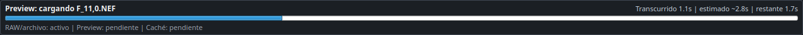
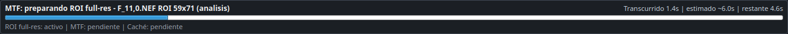

_Spanish version: [PERFORMANCE.es.md](PERFORMANCE.es.md)_

# Performance

This document includes the practical policy of performance measurement in
ProbRAW. Optimizations that affect canonical flow must preserve the
bytes of the signed TIFF unless documented as a reproducibility change.

## Tools

Granular profile of actual commands:
```powershell
python scripts/profile_pipeline.py --out-dir .\profile-out --top 80 -- batch-develop .\raws --recipe .\recipe.yml --profile .\camera.icc --out .\out --workers 1
```
The script writes:

- `profile.txt`: output of `cProfile` ordered by accumulated time.
- `profile.svg`: flamegraph of `py-spy` if installed.

To compare serial versus parallel batch, run the same command changing
only `--workers 1` for `--workers 0` or for a fixed number.

RAW Benchmark playable on Windows, macOS and Linux:
```powershell
python scripts/benchmark_raw_pipeline.py .\ruta\a\captura.NEF --out .\tmp\raw_benchmark\results.json --cache-dir .\tmp\raw_benchmark\cache --algorithms linear,dcb,amaze --cache-algorithm dcb --process-jobs 4 --process-workers 1,2,4
```
The script measures wall time, CPU, shape/dtype, array size and peak
resident memory of the process when exposed by the operating system.

GUI Fluency Benchmark:
```powershell
$env:QT_QPA_PLATFORM="offscreen"
python scripts/benchmark_gui_interaction.py --raw .\ruta\a\captura.NEF --algorithm dcb --full-resolution --out .\tmp\gui_benchmark\d850_full_ui.json
```
This test simulates real slider drags and pitch curves. Measures:

- immediate cost of `setValue`/curve point emission,
- p95/p99/max of gaps of the Qt event loop,
- time of the last interactive preview,
- pending threads at the end.

## Workers policy

`batch-develop` and the batch phase of `auto-profile-batch` accept `--workers`.

- Omitted or `0`: automatic selection based on CPU and RAM.
- `1`: serial execution for debugging and regression.
- `N > 1`: real parallelism per process, limited by the number of files.

The output remains stable because the manifest maintains the planned order
of entry, not the order of completion of the workers.

If a non-serializable Python C2PA client is injected, the batch uses threads like
conservative fallback. The normal CLI route uses processes.

Control variables:

- `PROBRAW_BATCH_WORKERS`: default workers.
- `PROBRAW_BATCH_MEMORY_RESERVE_MB`: Free RAM reserved before calculating
  automatic workers.
- `PROBRAW_BATCH_WORKER_RAM_MB`: estimated budget per worker.
  By default it is 2800 MiB, adjusted from a 45.7 MP D850: the
  DCB demosaic consumes ~1.52 GiB per process and the real batch needs margin
  additional to write linear/final TIFF.
- `PROBRAW_TIFF_MAXWORKERS`: compression threads per TIFF for `tifffile`.
  If omitted, ProbRAW distributes CPU automatically in compressed batches; for
  a single export, `tifffile` keeps its automatic mode.

## Numerical demosaic cache

The demo cache is opt-in. It is activated in a recipe with:
```yaml
use_cache: true
```
And it can be located from CLI with `develop`, `batch-develop` and
`auto-profile-batch`:
```powershell
python -m probraw batch-develop .\01_ORG --recipe .\recipe.yml --profile .\camera.icc --out .\02_DRV --cache-dir .\00_configuraciones\cache
```
If `--cache-dir` is not indicated, ProbRAW attempts to use
`00_configuraciones/cache/` of the session. If it cannot infer a session, use
`~/.probraw/cache/`.

The key includes full RAW SHA-256, demosaic algorithm, balance
whites, black mode and rawpy/LibRaw backend signature. Does not include settings
render that are applied after the linear scene, such as exposure or curve.

LRU pruning is controlled with `PROBRAW_DEMOSAIC_CACHE_MAX_GB` and by default
limits the cache to 5 GiB.

## Canonical Goldens

`tests/regression/` tests validate output canonical SHA-256 and TIFF
audit line. The golden force recipe `use_cache: false` so that the
regression measures canonical bytes, not cache behavior.

Intentional regeneration:
```powershell
python scripts/regenerate_golden_hashes.py --confirm --note "motivo del cambio"
```
A regeneration must be accompanied by an explanation in the changelog if the
reproducibility.

## Local benchmark D850

Equipment used: Windows 11, Python 3.12.4, 32 logical threads, RAW Nikon D850
8288x5520 of 51.5 MiB contributed locally for benchmark. RAW does not form
part of the repository.

| Case | Weather |
| --- | ---: |
| Demosaic `linear` complete | 1.52s |
| Demosaic `dcb` complete | 5.36s |
| Demosaic `amaze` complete | 5.57s |
| Cache populate `dcb` | 5.63s |
| Cache hit `dcb` | 0.16s |
| Preview half-size `dcb` | 0.85-0.88s |
| CLI `develop` no cache, audit + final TIFF | 7.24s |
| CLI `develop` with cache hit, audit + final TIFF | 1.59s |

Benchmark GUI with the same RAW, Qt `offscreen`, 80 steps per control:

| Source | Control | p95 UI event | p95 event loop | max event loop | Final preview |
| --- | --- | ---: | ---: | ---: | ---: |
| D850 half-size 2760x4144 | glitter | 0.063ms | 16.84ms | 55.32ms | 272ms |
| D850 half-size 2760x4144 | tone curve | 0.128ms | 16.87ms | 49.41ms | 434ms |
| D850 full 5520x8288 | glitter | 0.053ms | 16.72ms | 58.94ms | 275ms |
| D850 full 5520x8288 | tone curve | 0.094ms | 16.78ms | 49.51ms | 443ms |

Before queuing the final heavy refresh, the max of the event loop on release
controls reached ~0.6-1.0 s in half-size. After the change there is around
50-60 ms and the heavy lifting appears as asynchronous final preview.

`dcb` demosaic scaling by processes:

| Jobs | Workers | Total time | Peak by worker |
| ---: | ---: | ---: | ---: |
| 4 | 1 | 21.31s | ~1.52 GiB |
| 4 | 4 | 5.97s | ~1.52 GiB |
| 8 | 8 | 7.17s | ~1.52 GiB |

Operational conclusion: the demosaic scales well by processes, but the selection
automatic should be limited by RAM. In real batch each worker needs more margin
than the isolated demosaic because it also generates linear and final TIFF.

## ICC-managed Preview

The colorimetric preview path avoids embedded thumbnails when a session ICC or
generic profile is active, because those thumbnails can already be baked into a
different space and are not valid for color review. To keep curve editing from
blocking:

- no managed image is left without an input profile; if no session/image ICC
  exists, preview uses a real generic profile;
- loading uses LibRaw development bounded by `PREVIEW_AUTO_BASE_MAX_SIDE`,
  except for 1:1 precision, compare and chart marking;
- at 100%, sliders and curves update the visible crop and copy only `QImage`
  regions when possible;
- visible conversion remains `source ICC -> monitor ICC`; dense 8-bit LUTs are
  generated by LittleCMS, cached in RAM/on disk and speed up the transform
  without changing the result;
- curves reuse tonal LUTs and share RGB quantization before applying the ICC
  conversions for display and instruments;
- heavy final preview runs in an asynchronous worker when the image exceeds
  2 MP;
- a watchdog abandons non-responsive interactive workers and resumes the
  adjustment queue so the UI does not remain stuck in "Adjusting...".

Real GUI benchmark with `G:\ProbRAW-TEST\01_ORG\f_16,0.NEF`, DCB, 100%,
ProPhoto RGB, monitor ICC and clipping overlay enabled:

| Control | Last visible preview |
| --- | ---: |
| Brightness/normal changes | ~41-44 ms |
| Tone curve | ~62 ms |

This preserves strict color management while reducing long UI stalls without
sacrificing colorimetry or sharpness.

### Interactive Preview 0.3.11

The interactive path again uses bounded proxy sources during color, contrast,
curve and sharpness drags when the viewer is not in real 1:1 inspection. This
restores the responsiveness observed in the 0.3.8 series without treating a
cached preview as real pixels.

Operational rules:

- if the viewer is at real scale and the loaded source contains real pixels,
  sharpness preview works on the 1:1 viewport without downscaling;
- if the user requests real detail but the current display is a proxy, the full
  source is forced before analysis;
- if the loaded RAW comes from a reduced cache, the viewport is not marked as
  real-pixel even when visual scale is 100%;
- zoom or viewport changes reschedule the visible preview so active adjustments
  apply to the whole region the user is viewing.

Local synthetic benchmark after the change:

| Case | Before | After |
| --- | ---: | ---: |
| Sharpness 2160x3240 | ~530 ms | ~91 ms |
| Sharpness 4000x6000 | ~1.75 s | ~86 ms |
| Color/curves | ~20-62 ms | ~20-62 ms |

## RAW MTF Strategy And Global Operation Viewer

Detected problem: cold MTF analysis on RAW files needs a real-resolution image.
`rawpy.postprocess()` does not provide a documented Python crop parameter, so
developing the full RAW inside the UI thread blocked the application and could
consume large temporary memory on professional-size files.

Research applied:

- Imatest SFR works from slanted-edge ROIs/crops; the ROI is the natural unit of
  the MTF calculation, not the whole image.
- `rawpy` exposes full-image `postprocess()` and embedded `extract_thumb()`, but
  no documented crop parameter for postprocessing.
- LibRaw documents `cropbox` and crop-related structures, but that path is not
  portably exposed through `rawpy` and has format-specific implications.
- darktable separates thumbnails/previews/cache by resolution levels and uses
  persistent cache to avoid repeating expensive work.

Implemented decision:

- MTF analysis is limited to the selected ROI plus padding around the edge. The
  full image is developed only when the full-resolution ROI is cold.
- Full-resolution ROI preparation runs in an external process
  (`python -m probraw.analysis.mtf_roi`) to isolate CPU/RAM and keep the UI
  responsive if LibRaw needs temporary memory.
- The full-resolution ROI is stored as a small `.npz` block in persistent cache,
  keyed by RAW, recipe, dimensions and ROI. Later ESF/LSF/MTF recalculations use
  that block.
- Automatic MTF recalculation is deferred when the full-resolution ROI is cold;
  the user explicitly starts the expensive work with `Actualizar`.
- With a hot full-resolution ROI, sharpness controls refresh ESF/LSF/MTF through
  an interactive throttle. The pending timer is not restarted on every slider
  event, so plots can update while dragging and not only after releasing the
  control.
- ProbRAW's top bar is now a global long-operation viewer. MTF, RAW preview
  loading and background tasks can publish status, elapsed time, estimate,
  remaining time and phase. The operational rule is to use it for work expected
  or observed to take roughly more than one second. The `Nitidez` tab no longer
  duplicates a second local progress bar.

Visual samples from the global viewer:





Local measurements with 11 NEF test files:

| Case | Result |
| --- | ---: |
| Cold RAW thumbnails, 11 files | ~1.10 s |
| RAW preview `DSC_0312.NEF` after optimization | ~2.95 s, peak ~957 MB |
| Cold MTF: click return | ~0.08-0.13 s |
| Cold MTF: full-res ROI worker | ~6.3-6.7 s |
| Hot MTF from ROI cache | ~0.07-0.11 s |

Real cold MTF run:

```text
call_return_seconds: 0.125
worker_wait_seconds: 6.718
mtf50: 0.117308
```

Alternatives evaluated:

- Direct Bayer ROI with local OpenCV demosaic: around 0.13 s on one ROI, but
  MTF50 differed from the full-resolution pipeline (`~0.106` vs `~0.117`). It
  remains a future candidate for a draft/provisional mode, not the canonical
  result.
- True RAW crop via `rawpy`: deferred because the documented API does not expose
  `postprocess()` cropping and a direct C++ LibRaw integration would increase
  maintenance cost.

References:

- Imatest SFR instructions: https://www.imatest.com/docs/sfr_instructions2/
- Imatest Bayer RAW SFR notes: https://imatest.atlassian.net/wiki/spaces/KB/pages/10882547817/SFR%2Bresults%2Bfrom%2BBayer%2Braw%2Bimages/
- rawpy `RawPy.postprocess()` / `extract_thumb()`: https://letmaik.github.io/rawpy/api/rawpy.RawPy.html
- rawpy `Params`: https://letmaik.github.io/rawpy/api/rawpy.Params.html
- LibRaw API notes, memory and buffers: https://www.libraw.org/docs/API-notes.html
- LibRaw data structures, `cropbox`: https://www.libraw.org/docs/API-datastruct.html
- darktable thumbnail cache: https://docs.darktable.org/usermanual/3.6/en/special-topics/program-invocation/darktable-generate-cache/

## Changes Applied

- Preview histograms and analysis panel downsample before converting
  and trim large arrays. This reduces temporary copies when working with
  1:1 previews without touching the canonical render.
- Basic diagnostic external calls (`exiftool`, `git rev-parse`)
  They have timeout to avoid indefinite blockages.
- ICC preview now uses LittleCMS2 via Pillow `ImageCms`; `xicclu` remains in the
  validation path for generated ICC profiles.
- The development batch no longer uses threads for CPU-bound work except fallback
  C2PA; each image is processed in a separate process.
- The numerical result of the demosaic can be persisted as `.npy` to avoid
  repeat LibRaw when only later settings change.
- The TIFF16 script uses fewer temporary intermediates than the expression
  `round(clip(x) * 65535).astype(uint16)`.
- Cold MTF analysis now runs through an external worker with persistent
  full-resolution ROI cache, and timings are published to the global operation
  viewer.
- RAW preview loading publishes global progress when the estimate or actual
  duration is roughly above one second.
